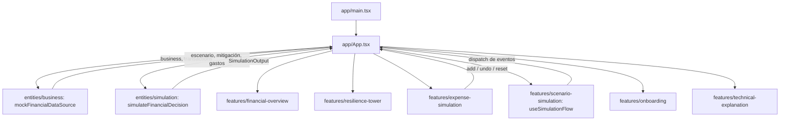
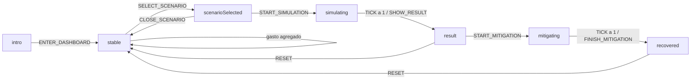

# Resilia — Documentación de la sesión y arquitectura

> **Estado al cierre de la sesión:** demo funcional con torre **3D**, registro de gastos, escenarios financieros y mitigación. Interfaz exclusivamente light. Datos y resultados analíticos simulados.
>
> Este documento describe el código existente y el trabajo realizado. Las mejoras futuras se identifican expresamente; no deben interpretarse como funcionalidades implementadas.
>
> **Migración de arquitectura completada.** El proyecto pasó de una organización por tipo técnico (`components/data/lib`, `App.tsx` monolítico) a una organización por features (`app -> features -> entities -> shared`), siguiendo `PLAN_MIGRACION_ARQUITECTURA.md`. pnpm es el único gestor de paquetes. Las secciones de este documento describen el árbol resultante, no el plan.

## 1. Producto y propósito

**Resilia** permite explorar el efecto de una decisión sobre la liquidez de una PyME antes de ejecutarla.

**Subtítulo:** «Decide hoy sin comprometer el mañana de tu negocio».

La idea central es:

> Una decisión puede ser rentable y aun así dejar al negocio sin efectivo antes de recibir sus ingresos.

La demo está diseñada para **Mariana**, dueña de **Distribuidora Luna**, con 12 empleados. Su negocio paga inventario y nómina antes de cobrar facturas y depende de pocos clientes grandes. La decisión principal consiste en aceptar un contrato con cobro a 60 días.

La torre representa el soporte financiero del negocio. Sus bloques son una metáfora visual de liquidez, ingresos, gastos y obligaciones; no constituyen una reproducción contable exacta.

### Alcance implementado

- Introducción sin login y acceso al dashboard.
- Métricas financieras y contexto del negocio.
- Torre 3D interactiva de 12 niveles y 36 bloques.
- Tres escenarios predefinidos.
- Secuencia de decisión, retraso, riesgo, colapso y mitigación.
- Registro de gastos adicionales, historial resumido y deshacer.
- Reinicio de la simulación.
- Explicación técnica ilustrativa.
- Diseño responsive, movimiento reducido y alternativa sin WebGL.
- Datos tipados, motor mock central, pruebas y build de producción.

### Fuera del alcance actual

No se implementaron backend, autenticación, base de datos, persistencia de los gastos, conexión efectiva a Nessie, homología persistente real ni predicción de quiebras. La aplicación no realiza operaciones financieras ni modifica cuentas reales.

## 2. Evolución durante la sesión

| Etapa | Trabajo realizado | Resultado |
| --- | --- | --- |
| Inspección inicial | Se revisó el repositorio, que estaba vacío. | Se creó una base React + TypeScript + Vite. |
| Primera versión | Se construyeron la interfaz light, datos, motor mock, torre 3D y escenarios. | Demo con el recorrido contrato → riesgo → colapso → anticipo. |
| Validación inicial | Se instalaron dependencias, se ejecutó el proyecto y se probaron vistas y flujos. | Se corrigieron problemas de compilación, compatibilidad y física. |
| Refinamiento 2D | A petición del usuario, la torre se sustituyó temporalmente por SVG animado. Se añadió la captura de gastos. | Cada gasto retiraba soporte, con deshacer y actualización de métricas. |
| Regreso a 3D | Se restauraron Three.js, React Three Fiber, Drei y Rapier. | Se conservaron las mejoras de gastos dentro de la experiencia 3D. |
| Documentación | Se actualizó el README y se redactó este documento. | Guía para usar, entender y continuar el proyecto. |

**La versión vigente es 3D.** La versión SVG fue una etapa intermedia, no un modo alternativo seleccionable. No existe selector entre 2D y 3D ni selector de tema.

## 3. Diseño de la experiencia

### Identidad visual

- Fondo claro y superficies blancas.
- Texto principal azul marino y texto secundario gris azulado.
- Azul financiero como color principal.
- Verde para cobros y señales positivas.
- Amarillo para incertidumbre y advertencias.
- Coral para obligaciones y fragilidad.
- Bordes discretos, radios moderados y sombras suaves.
- Fuente **Inter**, con pesos 400, 500, 600 y 700, instalada mediante `@fontsource/inter` y servida localmente.
- Iconos de Lucide React y transiciones de interfaz con Framer Motion.
- Etiqueta visible: **«Demo con datos simulados»**.

No se utilizaron imágenes generadas, Google Fonts ni assets remotos para construir la experiencia. La escena se compone de geometría, materiales y luces.

### Distribución

En escritorio, la información y los controles aparecen a la izquierda. La torre ocupa la derecha y usa posicionamiento sticky para acompañar la interacción al desplazarse.

En móvil, el orden es: contexto y métricas, torre, captura de gastos y escenarios. Al iniciar ciertas simulaciones o agregar un gasto, la interfaz desplaza la vista hacia la torre para mostrar el efecto.

Los detalles de escenarios se presentan mediante un diálogo nativo: panel lateral en escritorio y bottom sheet en móvil.

## 4. Stack y dependencias

Las versiones siguientes corresponden a las declaradas en `package.json` al redactar este documento.

| Tecnología | Versión | Responsabilidad |
| --- | --- | --- |
| React / React DOM | 19.1.1 | Componentes y estado de la interfaz |
| TypeScript | 5.9.2 | Tipos y comprobación estática |
| Vite | 7.3.6 | Desarrollo local y build |
| Three.js | 0.180.0 | Renderizado 3D |
| `@react-three/fiber` | 9.3.0 | Integración declarativa entre React y Three.js |
| `@react-three/drei` | 10.7.6 | `OrbitControls` y `RoundedBox` |
| `@react-three/rapier` | 2.2.0 | Cuerpos rígidos y colapso físico |
| Tailwind CSS / plugin Vite | 4.1.13 | Sistema de estilos: clases utilitarias en cada componente, tokens en `@theme` y reglas base en `@layer base` dentro de `src/app/styles.css` |
| Framer Motion | 12.23.12 | Transiciones de interfaz |
| Lucide React | 0.468.0 | Iconos |
| `@fontsource/inter` | 5.2.8 | Tipografía local |
| Playwright Test | 1.55.1 | Pruebas de navegador |
| `tsx` | 4.20.5 | Ejecución de pruebas TypeScript con Node |
| Prettier | Rango `^3.6.2` | Formato de código |

pnpm es el único gestor versionado (`packageManager` fijado en `package.json`, `pnpm-lock.yaml` es el único lockfile). No debe generarse `package-lock.json` ni `yarn.lock`; ambos están en `.gitignore` como recordatorio de la mezcla de instalaciones que causó ejecutables inconsistentes durante una fase temprana de la sesión.

## 5. Estructura del repositorio

```text
.
├── DOCUMENTACION_SESION.md
├── README.md
├── AGENTS.md
├── index.html
├── package.json
├── pnpm-lock.yaml
├── pnpm-workspace.yaml
├── tsconfig.json
├── vite.config.ts
├── playwright.config.ts
├── scripts/
│   └── check-import-boundaries.ts
├── src/
│   ├── app/                       # Composición: monta React, estado global mínimo
│   │   ├── main.tsx
│   │   ├── App.tsx
│   │   └── styles.css             # @import "tailwindcss"; tokens en @theme; reset en @layer base
│   ├── features/                  # Una carpeta por capacidad de producto
│   │   ├── onboarding/
│   │   ├── financial-overview/
│   │   ├── expense-simulation/
│   │   ├── scenario-simulation/
│   │   ├── resilience-tower/
│   │   └── technical-explanation/
│   ├── entities/                  # Dominio: tipos, fixtures, motor, fuente de datos
│   │   ├── business/
│   │   ├── scenario/
│   │   └── simulation/
│   └── shared/                    # Agnóstico al dominio: Modal, formatMoney
│       ├── ui/
│       └── lib/
├── tests/
│   └── demo.spec.ts
└── dist/                         # Generado por el build
```

Cada feature/entidad expone un `index.ts` como API pública; el resto de su carpeta (`ui/`, `model/`, `api/`, `fixtures/`) es interno. Las dependencias, los resultados de pruebas y los archivos generados indicados en `.gitignore` no forman parte del código fuente a mantener.

## 6. Arquitectura general

La aplicación es una SPA de una sola experiencia. No tiene router, servidor propio, store externo ni capa de persistencia. `App.tsx` es la raíz de composición: carga datos, conecta el flujo de simulación y distribuye props a las features; no implementa la lógica de ninguna capacidad de producto.

La dirección de dependencia es `app -> features -> entities -> shared` y se verifica con `pnpm check:boundaries` (`scripts/check-import-boundaries.ts`): una capa no puede importar de una capa superior, y cruzar de una feature/entidad a otra solo es válido a través del `index.ts` público de esa slice (no hay imports profundos entre slices).



El motor decide los resultados de la demo; es una función pura sin React ni Three.js. La torre interpreta esos resultados visualmente mediante un view model puro (`towerPresentation.ts`); la física no calcula la fragilidad ni la supervivencia.

### Responsabilidades por módulo

| Módulo | Responsabilidad actual |
| --- | --- |
| [src/app/main.tsx](src/app/main.tsx) | Monta React en `#root`, activa `StrictMode` e importa Inter y `styles.css`. |
| [src/app/App.tsx](src/app/App.tsx) | Composición: carga de datos (`useBusinessData`), deriva `SimulationOutput` para cada feature y conecta sus eventos. Cabecera, layout del dashboard y pie de página son la única UI propia que le queda. |
| [src/app/styles.css](src/app/styles.css) | `@import "tailwindcss"`, tokens de color/tipografía en `@theme`, reset y comportamiento de botones/foco en `@layer base`. El resto de la apariencia vive como clases utilitarias en cada componente. |
| [src/entities/business](src/entities/business) | `Business`, `FinancialTransaction`, `FinancialDataSource`, fixtures y `mockFinancialDataSource` (único punto que entrega negocio y transacciones a la UI). |
| [src/entities/scenario](src/entities/scenario) | `Scenario`, `ScenarioId` y el catálogo de tres decisiones. |
| [src/entities/simulation](src/entities/simulation) | `SimulationOutput`, `SimulatedExpense`, trayectorias (`fixtures/projections.ts`) y `simulateFinancialDecision` — el motor, sin dependencias de UI. |
| [src/features/scenario-simulation](src/features/scenario-simulation) | `useSimulationFlow` (reducer de la máquina de estados del flujo) y la UI de escenarios, progreso y resultado. |
| [src/features/resilience-tower](src/features/resilience-tower) | `towerPresentation.ts` (view model puro) y la UI 3D: `ResilienceTower`, `TowerScene`, `TowerBlock`, `TowerFallback`, `TowerCard`. |
| [src/features/expense-simulation](src/features/expense-simulation) | `useExpenses`, `ExpensePanel` y `ExpenseFeedback`. |
| [src/features/financial-overview](src/features/financial-overview) | Panel de saldo, fragilidad, supervivencia y buffer. |
| [src/features/onboarding](src/features/onboarding) | Pantalla de introducción. |
| [src/features/technical-explanation](src/features/technical-explanation) | Diálogo «¿Cómo lo calculamos?». |
| [src/shared/ui/Modal.tsx](src/shared/ui/Modal.tsx) | Diálogo nativo reutilizable (escenarios y explicación técnica), cierre con Escape, restaura el foco. |
| [src/shared/lib/formatMoney.ts](src/shared/lib/formatMoney.ts) | Formato de moneda MXN, separado del motor financiero. |
| [scripts/check-import-boundaries.ts](scripts/check-import-boundaries.ts) | Verifica en CI/local que no haya dependencias inversas ni imports profundos entre slices. |
| [vite.config.ts](vite.config.ts) | Plugins React/Tailwind, alias `@app`/`@features`/`@entities`/`@shared` y separación de chunks de Three.js y física. |

**Grado de modularización:** cada capacidad de producto es localizable por nombre y expone una API pública propia; ninguna feature importa los internos de otra. `App.tsx` pasó de 778 a menos de 400 líneas, todas de composición.

## 7. Estado y flujo de la aplicación

### Estados explícitos

| Estado (`SimulationFlowState`) | Significado en la interfaz |
| --- | --- |
| `intro` | Pantalla inicial y negocio seleccionado |
| `stable` | Dashboard base; también permite registrar gastos |
| `scenarioSelected` | Detalles de un escenario abiertos |
| `simulating` | Secuencia temporal de simulación |
| `result` | Resultado de un escenario terminado |
| `mitigating` | Aplicación del anticipo |
| `recovered` | Resultado posterior a la mitigación |

**Distinción importante:** `SimulationFlowState` expresa la etapa del flujo, mientras que `SimulationOutput.status` expresa el riesgo financiero. El estado de interfaz `result` también se utiliza al terminar los escenarios de equipo o retraso, aunque su resultado financiero sea «Precaución». Igualmente, gastos manuales pueden volver crítico el resultado mientras el flujo sigue en `stable`. (Este estado se llamaba `critical` antes de la migración de arquitectura; se renombró a `result` en `features/scenario-simulation` precisamente para evitar la confusión con el riesgo financiero «Crítico».)

El flujo es un reducer (`flowReducer` en `features/scenario-simulation/model/simulationFlow.ts`) con eventos explícitos — `ENTER_DASHBOARD`, `SELECT_SCENARIO`, `CLOSE_SCENARIO`, `START_SIMULATION`, `TICK`, `SHOW_RESULT`, `START_MITIGATION`, `FINISH_MITIGATION`, `CLEAR_SKIP`, `RESET` — en vez de llamadas `setState` sueltas; una transición no representada en el reducer simplemente no cambia el estado.



### Estado complementario

Dentro de `FlowState` (el reducer):

- `scenario`: escenario seleccionado.
- `progress`: avance entre 0 y 1.
- `resetKey`: fuerza la reconstrucción de la escena cuando corresponde.
- `skipAnimation`: indica que se solicitó el resultado inmediato (`CLEAR_SKIP` lo reinicia al agregar un gasto nuevo, para que ese colapso se anime aunque ya se hubiera omitido una animación previa).

Fuera del reducer, en `App.tsx` y sus hooks:

- `expenses` (`useExpenses`, en `features/expense-simulation`): gastos simulados acumulados, en memoria.
- `technical`: controla el panel de explicación técnica.
- `reduced` (`useReducedMotion`): preferencia de movimiento reducido del dispositivo; se pasa a `useSimulationFlow` para las duraciones del temporizador.

`starting` calcula la referencia con los gastos actuales y sin escenario. `beforeMitigation` calcula el escenario antes del anticipo. Se usan para que las comparaciones y transiciones no vuelvan siempre a los valores iniciales cuando ya se han agregado gastos.

El reinicio limpia gastos, escenario y progreso, y vuelve al dashboard. Recargar la página también pierde los gastos, ya que no hay persistencia.

## 8. Modelo de datos

### Tipos principales

| Tipo | Campos o propósito |
| --- | --- |
| `Business` | Identificador, nombre, propietaria, empleados, saldo y concentración |
| `FinancialTransaction` | Fecha, monto, dirección, categoría, contraparte, estado y confianza |
| `Scenario` | Identificador de decisión, título, descripción, monto y detalles |
| `WeeklyProjection` | Semana, saldo, ingresos y gastos |
| `TowerChange` | Semana y acción visual: retirar liquidez, agregar ingreso, retrasar ingreso o agregar liquidez |
| `SimulatedExpense` | Identificador, categoría y monto de un gasto introducido por el usuario |
| `SimulationOutput` | Métricas, proyecciones, cambios visuales, recomendación, riesgo y acumulado de gastos |
| `FinancialDataSource` | Métodos asíncronos `getBusiness()` y `getTransactions()` |

Las transacciones cubren nómina, renta, inventario, servicios, crédito, cobros, impuestos, transporte y mantenimiento. Se generan 40 registros entre septiembre y diciembre de 2026, con importes y estados repetibles. Son fixtures, no un extracto bancario real.

`mockFinancialDataSource` (en `entities/business/api/`) implementa el contrato asíncrono del proveedor y es el único punto que entrega `business`/`transactions` a la aplicación: `App.tsx` los obtiene mediante un hook (`useBusinessData`) con estados `loading`/`ready`/`empty`/`error`, no mediante un import directo de los fixtures. Sustituir el mock por una integración real a Nessie implica reemplazar únicamente `mockFinancialDataSource`.

Los gastos manuales usan identificadores creados con `crypto.randomUUID()`. Esos identificadores no afectan los cálculos: mismos importes y escenarios producen los mismos resultados financieros.

## 9. Motor financiero mock

### Interfaz pública

```typescript
simulateFinancialDecision(
  business: Business,
  transactions: FinancialTransaction[],
  scenario: Scenario | null,
  mitigations: string[] = [],
  expenses: SimulatedExpense[] = [],
): SimulationOutput
```

El motor valida que haya transacciones, que el saldo sea finito y que los gastos adicionales tengan importes positivos y finitos. La UI agrega sus propias restricciones de entrada.

**Cómo funciona realmente:** selecciona una trayectoria predeterminada de `projections.ts`, toma métricas base de una tabla y aplica reglas aritméticas para los gastos adicionales. No reconstruye el flujo financiero a partir de las 40 transacciones. El parámetro `transactions` se conserva como contrato de integración y se valida que no esté vacío.

### Resultados base, sin gastos adicionales

| Escenario | Fragilidad | Supervivencia | Buffer recomendado | Saldo mínimo proyectado | Riesgo |
| --- | ---: | ---: | ---: | ---: | --- |
| Situación inicial | 31 | 14 semanas | $24,000 | $156,000 | Estable |
| Contrato y retraso automático | 78 | 7 semanas | $96,000 | −$96,000 | Crítico |
| Contrato con anticipo del 40% | 43 | 12 semanas | $18,000 | $32,000 | Precaución |
| Comprar equipo | 49 | 10 semanas | $42,000 | $92,000 | Precaución |
| Retraso de cliente | 64 | 8 semanas | $72,000 | $4,000 | Precaución |

Todos los importes son MXN. El dashboard también muestra saldo inicial de $280,000, nómina de $72,000 en seis días y concentración del principal cliente de 42%.

### Reglas de gastos manuales

Si `G` es la suma de gastos agregados:

```text
saldo disponible mostrado = saldo del negocio − G

bloques retirados por gastos =
  mínimo(35, suma(máximo(1, techo(monto del gasto / 24,000))))

fragilidad = mínimo(100, fragilidad base + redondeo(G / 3,000))

supervivencia = máximo(0, semanas base − techo(G / 20,000))

saldo proyectado por semana =
  saldo de la trayectoria + saldo del negocio − 280,000 − G

buffer recomendado =
  máximo(buffer base + redondeo(G × 0.15), −saldo mínimo proyectado)
```

Los gastos adicionales se cargan a la primera semana para mantener la identidad de caja:

```text
saldo anterior + ingresos − gastos = saldo de la semana
```

El riesgo es «Crítico» si la fragilidad alcanza 70 o si el saldo mínimo es negativo; «Precaución» desde 40; «Estable» en otro caso.

Estas fórmulas son reglas de demostración, no un modelo calibrado ni una recomendación financiera validada. La categoría del gasto sirve para identificarlo en la interfaz; no modifica su tratamiento analítico actual.

### Ejemplo reproducible

Agregar $24,000, luego $72,000 y después $95,000, sin escenario predefinido, produce:

| Métrica | Resultado |
| --- | ---: |
| Gastos acumulados | $191,000 |
| Saldo disponible | $89,000 |
| Bloques retirados | 8 |
| Fragilidad | 95 |
| Supervivencia | 4 semanas |
| Buffer recomendado | $52,650 |
| Saldo mínimo proyectado | −$35,000 |

Aunque todavía hay saldo disponible, la proyección presenta un faltante futuro. Esa diferencia es la razón narrativa para el colapso.

### Semántica de la semana crítica

`criticalWeek` señala la semana con **el saldo más bajo**, siempre que sea negativo. No representa necesariamente la primera semana sin liquidez. En el contrato, la primera proyección negativa ocurre en la semana 6 y el mínimo de −$96,000 ocurre en la semana 7, que es la «Semana crítica» mostrada.

La supervivencia es otra métrica mock y no se deduce directamente de esa primera semana negativa. Hay 12 semanas de proyección, aunque la situación inicial indique 14 semanas de supervivencia; no existe una extrapolación real detrás de ese valor.

## 10. Escenarios y narrativa

### Aceptar nuevo contrato

- Inversión inicial: $180,000.
- Ingreso esperado: $320,000.
- Cobro a 60 días.
- Margen estimado mostrado: 28%.

El margen es un dato del escenario, no el resultado de restar solamente inversión inicial e ingreso. El panel aclara que hay otros costos del contrato.

La animación de interfaz dura aproximadamente ocho segundos. El progreso cambia los mensajes, retira soporte inicial, colorea cobros futuros, introduce un retraso de 30 días y activa el colapso. El resultado explica que rentabilidad y liquidez no son equivalentes.

### Mitigación

«Aplicar anticipo del 40%» activa la mitigación `advance40`, con una transición de aproximadamente 1.8 segundos. Se reconstruye la escena y se refuerzan visualmente las primeras semanas.

Si existen gastos adicionales que el anticipo no cubre, la UI no presenta la recuperación como suficiente: puede mostrar «El anticipo aún no cubre tus gastos» y mantener un resultado crítico.

### Escenarios alternativos

- **Comprar equipo:** $110,000 iniciales, ahorro mensual ilustrativo de $18,000 y recuperación indicada de siete meses.
- **Retraso de cliente:** cobro afectado de $160,000, retraso de 30 días y concentración de 42%.

Ambos tienen resultado y recomendación propios. No toda simulación produce un colapso.

## 11. Torre 3D y física

### Componentes internos

`features/resilience-tower/` separa la traducción de datos del runtime 3D:

- `model/towerPresentation.ts`: función pura `computeTowerViewModel()` — traduce `SimulationOutput` + estado del flujo a `{ lost, collapsed, staticFall, risk, description, blockColors }`. Sin React, DOM ni Three.js; probada sin WebGL.
- `ui/ResilienceTower.tsx`: orquestador delgado — detecta WebGL, guarda el bloque seleccionado y arma el `aria-label` a partir del view model.
- `ui/SceneBoundary` (dentro de `ResilienceTower.tsx`): captura errores de renderizado y ofrece una alternativa textual.
- `ui/TowerScene.tsx`: el runtime 3D propiamente dicho — `Canvas`, cámara, luces, `OrbitControls` y el grupo de física con su balanceo y temporizador de colapso.
- `ui/TowerBlock.tsx`: un bloque con geometría redondeada y cuerpo rígido.
- `ui/TowerFallback.tsx`: el contenedor de texto reutilizado por el fallback sin WebGL, el `Suspense` y `SceneBoundary`.
- `ui/TowerCard.tsx`: la tarjeta que envuelve la torre en el dashboard (encabezado, leyenda, pie).

Cambiar una regla financiera o un color no requiere tocar `TowerScene.tsx`/`TowerBlock.tsx`, y viceversa.

### Construcción visual

- 12 niveles, tres bloques por nivel.
- Orientación alternada de 90 grados.
- Geometría aproximada por bloque: `0.72 × 0.44 × 2.3` unidades.
- Materiales con rugosidad y metalizado discretos.
- Plano claro, luz ambiental, luz direccional cálida, sombras y niebla suave.
- Cámara en perspectiva y `OrbitControls`, con desplazamiento lateral deshabilitado y zoom limitado.
- DPR limitado al rango 1–1.5 y mapa de sombras de 1024 × 1024.

| Color | Significado |
| --- | --- |
| Azul | Liquidez disponible |
| Verde | Cobros esperados |
| Gris | Gastos operativos |
| Coral | Obligaciones |
| Amarillo | Cobros retrasados o inciertos |

Los detalles al tocar un bloque son representativos: semana, concepto, importe y estado. No están enlazados uno a uno con las transacciones mock.

### Retirada y caída

Los bloques perdidos combinan gastos manuales y cambios del escenario, con un máximo de 35. La escena omite esos cuerpos y ajusta la altura de los restantes según niveles retirados.

En situación estable, los cuerpos son fijos y el grupo presenta un balanceo leve. Al colapsar, pasan a dinámicos y reciben velocidades lineales y angulares definidas para hacer visible la caída.

- Gravedad: `[0, -9.81, 0]`.
- Paso físico: `1/60`.
- Fricción: `0.65`.
- Restitución: `0.12`.
- La simulación física se pausa aproximadamente 2.8 segundos después de activarse el colapso.

Los gastos manuales provocan colapso cuando el saldo mínimo proyectado es negativo. Para los escenarios, el colapso se activa en la fase final correspondiente si el resultado es crítico.

El estado y los parámetros financieros son deterministas. La física es una representación controlada; no se garantiza una trayectoria idéntica de cada bloque entre dispositivos o tasas de renderizado.

### Reinicio, omisión y recuperación

`resetKey` y el número de bloques perdidos por gastos forman la clave del `Canvas`, de modo que se reconstruyen cámara y cuerpos cuando corresponde. El detalle seleccionado también se limpia.

Al omitir la animación o usar movimiento reducido, el estado crítico puede representarse mediante una disposición estática de bloques caídos. No es necesario ejecutar toda la física para conocer el resultado.

## 12. Captura de gastos

El formulario permite elegir nómina, inventario, renta, servicios, crédito, impuestos, transporte, mantenimiento u otro gasto.

- Monto requerido, positivo y finito.
- Control numérico de 1 a 10,000,000 MXN, con paso de un peso.
- Accesos rápidos: nómina de $72,000, inventario de $95,000 y renta de $24,000.
- Total acumulado y contador de gastos.
- Visualización de las últimas tres entradas, aunque todos los gastos permanecen en el cálculo.
- «Deshacer último gasto» revierte la última entrada.
- Controles deshabilitados mientras se ejecuta una simulación o mitigación.

El saldo del objeto `business` no se modifica: el valor mostrado se deriva del saldo inicial menos el acumulado. Esto facilita deshacer y reiniciar sin alterar los datos base.

## 13. Accesibilidad y rendimiento

### Implementado

- Formularios con etiquetas y controles nativos.
- Diálogo HTML con gestión nativa del foco, Escape y restauración del foco anterior.
- Texto accesible con estado de la torre y bloques retirados.
- Resultados e historial con regiones de actualización anunciables.
- Ruta de simulación accesible mediante teclado.
- Preferencia de movimiento reducido aplicada a la torre y los tiempos de simulación.
- Botón para omitir la secuencia.
- Detección preventiva de WebGL2 y fallback textual.
- Fuentes locales, recursos locales y ausencia de llamadas de negocio externas.
- División de chunks de Three.js y del runtime de física en el build.

### Límites de la validación

No se realizó una auditoría formal WCAG, un benchmark de FPS en teléfonos físicos ni una validación exhaustiva con lectores de pantalla. La inspección individual de bloques 3D es principalmente por puntero; la alternativa textual permite conocer el estado financiero sin operar la escena.

La versión 2D temporal redujo el bundle al retirar la escena 3D. Al restaurarla volvieron las dependencias gráficas y físicas. El build final puede advertir chunks mayores de 500 kB; esto no impide la compilación, pero el peso sigue siendo una oportunidad de optimización.

## 14. Instalación y ejecución

pnpm es el único gestor admitido (ver sección 4). `npm install`/`yarn` no deben usarse: generan un lockfile distinto y, según el diagnóstico que motivó la migración de arquitectura, resoluciones inconsistentes si conviven con `node_modules` instalado por pnpm.

```sh
pnpm install
pnpm dev
```

La base de herramientas utilizada requiere Node.js 20.19+ o 22.12+ y pnpm ≥11 (fijado en `packageManager`). Vite imprime la URL disponible; si el puerto está ocupado, puede seleccionar otro.

La última URL de demo utilizada durante la sesión fue `http://localhost:5174/`. Es una dirección local, no una publicación en internet ni una garantía de que el proceso continúe activo después de cerrar el entorno.

Para solicitar ese puerto:

```sh
pnpm dev -- --port 5174
```

### Build de producción

```sh
pnpm build
```

El comando ejecuta `tsc -b` y después `vite build`. Los artefactos quedan en `dist/`.

Para revisar el build localmente:

```sh
pnpm exec vite preview --host 127.0.0.1 --port 4173
```

No se desplegó la aplicación a un hosting público durante esta sesión.

## 15. Pruebas y validaciones realizadas

### Pruebas unitarias

`pnpm test` ejecuta con el runner nativo de Node (`--import tsx`) todo archivo que haga match con `src/**/*.test.ts`, sin importar en qué feature o entidad viva:

- [src/entities/simulation/model/simulateFinancialDecision.test.ts](src/entities/simulation/model/simulateFinancialDecision.test.ts): valores base de los cinco escenarios (incluidos equipo y retraso, antes cubiertos solo indirectamente), determinismo, identidad de caja, acumulación de gastos y el ejemplo de $191,000 documentado en la sección 9.
- [src/features/scenario-simulation/model/simulationFlow.test.ts](src/features/scenario-simulation/model/simulationFlow.test.ts): el reducer del flujo — recorrido feliz, `SHOW_RESULT`/`FINISH_MITIGATION` con y sin `skip`, `CLEAR_SKIP`, transiciones inválidas ignoradas y `RESET` desde cualquier estado.
- [src/features/resilience-tower/model/towerPresentation.test.ts](src/features/resilience-tower/model/towerPresentation.test.ts): el view model de la torre (bloques perdidos, colapso, `staticFall`, colores por bloque, descripción accesible) sin WebGL ni Canvas.

```sh
pnpm test
```

### Pruebas de navegador

Archivo: [tests/demo.spec.ts](tests/demo.spec.ts).

```sh
pnpm exec playwright install chromium
pnpm test:e2e
```

El servidor debe estar activo. Para un puerto diferente:

```sh
PLAYWRIGHT_BASE_URL=http://localhost:5174 pnpm test:e2e
```

`PLAYWRIGHT_EXECUTABLE_PATH` permite indicar un Chromium ya instalado. Se utilizó esa opción durante la sesión para evitar otra descarga de navegador.

La configuración define dos proyectos:

| Proyecto | Viewport | Configuración |
| --- | --- | --- |
| `desktop` | 1440 × 1100 | Navegador de escritorio |
| `mobile` | 390 × 844 | Emulación móvil e interacción táctil |

Cuatro casos se ejecutan en ambos proyectos, para un total de ocho:

1. Entrada, contrato, retraso automático, resultado, anticipo, recuperación, reinicio, escenarios alternativos y panel técnico.
2. Recorrido por teclado con movimiento reducido.
3. Simulación sin WebGL y omisión de animaciones.
4. Captura de gastos, estado de colapso, deshacer y reinicio.

El recorrido principal recoge errores de consola y de página y comprueba que no existan solicitudes fuera del origen local, salvo recursos `data:` y `blob:`. También hay comprobaciones de desbordamiento horizontal.

**Resultado registrado tras la migración de arquitectura:** `pnpm typecheck`, `pnpm test` (19 pruebas unitarias), `pnpm build` y las ocho pruebas de navegador pasan sobre el árbol final por features. `pnpm check:boundaries` no reporta dependencias inversas ni imports profundos entre slices. Se revisaron capturas de las vistas móvil y escritorio en cada fase de la migración, incluida la conversión a Tailwind, comparándolas contra el diseño previo a simple vista (sin herramienta de diff de píxeles). Las capturas de prueba se escriben en `/tmp`; son evidencias temporales, no assets de la aplicación.

Las aserciones de la suite final comprueban estado accesible, resultados y presencia del canvas; no certifican físicamente cada colisión. La caída también fue inspeccionada visualmente durante el desarrollo.

Esta actualización documental no ejecuta de nuevo la suite: describe las validaciones efectuadas durante la implementación.

## 16. Problemas encontrados y resueltos

| Problema | Resolución aplicada |
| --- | --- |
| Versiones de React y librerías 3D con rangos incompatibles | Se fijaron versiones compatibles para la demo. |
| Framer Motion resolvía una versión incompatible de `motion-dom` | Overrides: `motion-dom` 12.23.12 y `motion-utils` 12.23.6. |
| Diferencias entre instalaciones npm y pnpm | Se conservaron las restricciones en ambos gestores y se sincronizaron lockfiles. |
| Scripts de instalación de esbuild y Tailwind pendientes en pnpm | Se habilitaron en `pnpm-workspace.yaml`. |
| Operaciones físicas sobre referencias retiradas | Se ajustó el ciclo de vida de cuerpos y se verificó validez y tipo dinámico antes de aplicar movimiento. |
| Colapso poco visible | Se ajustaron soporte, velocidades y duración de la caída. |
| Fallback de WebGL no visible en algunos casos | Se añadió detección previa y una alternativa textual fuera del canvas. |
| Ejecutable Playwright inconsistente tras mezclar instalaciones | `test:e2e` utiliza directamente el CLI de `@playwright/test`. |
| Cambios de dependencias y servidores locales antiguos | Se reinició Vite con la instalación vigente y se repitieron verificaciones. |

Las auditorías de dependencias ejecutadas después de los ajustes reportaron cero vulnerabilidades en ese momento. Esto es un resultado histórico de la sesión, no una garantía permanente.

## 17. Integraciones futuras

### Capital One Nessie

Punto de entrada: `FinancialDataSource` (interfaz) y `mockFinancialDataSource` (implementación), en `entities/business/api/`. `App.tsx` ya consume este proveedor mediante `useBusinessData()` con estados `loading`/`ready`/`empty`/`error` — ese paso, antes pendiente, se completó durante la migración de arquitectura.

Trabajo pendiente:

1. Implementar un proveedor real que adapte cuentas y transacciones de Nessie al modelo tipado (`Business`, `FinancialTransaction`).
2. Normalizar fechas, monedas, categorías, confianza y estados entre el formato de Nessie y el contrato actual.
3. Definir una capa segura para credenciales y autorización; no colocar secretos en el bundle del navegador.

La etiqueta «Datos simulados desde Capital One Nessie» forma parte del relato de la demo. No significa que los datos actuales procedan de una consulta a Nessie.

### Motor TDA

Punto de entrada: comentarios e interfaz de salida en `entities/simulation/model/simulateFinancialDecision.ts`.

Pendiente: representación de series, cálculo topológico, calibración, validación y traducción de señales a métricas interpretables. El diagrama del panel técnico es ilustrativo y no procede de un cálculo de persistencia.

### Simulación de caja real

Debe sustituir las trayectorias fijas y las reglas de gastos por una proyección a partir de cobros y pagos fechados. Conviene mantener un contrato equivalente a `SimulationOutput` para reducir cambios en la interfaz.

Antes de hacerlo, deben definirse con precisión supervivencia, primera semana de faltante, semana de mayor déficit, buffer y relación entre señal estructural y fragilidad.

## 18. Límites actuales y siguientes pasos sugeridos

La migración de arquitectura (`PLAN_MIGRACION_ARQUITECTURA.md`) resolvió varios puntos que este documento listaba antes como pendientes: separación de `App.tsx` en features, renombre de `critical` a `result`, extracción de `towerPresentation.ts` como adaptador de presentación, y conexión de `mockFinancialDataSource`. Lo que sigue pendiente, no como trabajo realizado:

- **Dos comportamientos preexistentes, encontrados y preservados durante la conversión a Tailwind (no corregidos a propósito, para no mezclar un cambio de comportamiento con un refactor puro):**
  - Las etiquetas de semana de la torre («SEMANA 12», «SEMANA 1») están ocultas (`hidden` en `TowerCard.tsx`) porque una regla CSS heredada de la etapa 2D las ocultaba siempre, en cualquier tamaño de pantalla. Si el diseño pretende mostrarlas, quitar `hidden` de esos dos `div`.
  - El subtítulo «Sin afectar tu negocio real» junto a «Prueba una decisión» está oculto (`hidden` en `App.tsx`) por la misma razón: dos reglas CSS heredadas (una para móvil, una para el layout de escritorio) lo ocultaban en todo viewport real.
- El breakpoint intermedio (701–1000px, entre el layout de una columna y el de escritorio con torre sticky) no se verificó con el mismo detalle que móvil (≤700px) y escritorio (≥1550px) durante la conversión a Tailwind; es posible que haya diferencias menores de espaciado en ese rango específico.
- ESLint sigue diferido (decisión de la Fase 1): no hay reglas de lint más allá de `tsc` y `pnpm check:boundaries`.
- Incorporar navegación por teclado para consultar semanas y bloques individuales.
- Validar contraste y accesibilidad con herramientas específicas y usuarios.
- Perfilar renderizado y consumo de memoria en teléfonos físicos.
- Revisar carga diferida del módulo 3D; no se implementó porque no hay una medición que confirme que compensa la complejidad adicional del fallback.
- Añadir persistencia, exportación o autenticación solamente si pasan a formar parte del alcance del producto.
- Reemplazar reglas mock únicamente cuando existan definiciones analíticas y datos adecuados para validarlas.

## 19. Guion breve de demostración

1. Abrir Resilia y entrar a Distribuidora Luna.
2. Explicar la torre y los valores iniciales: 31 de fragilidad y 14 semanas de supervivencia.
3. Agregar un gasto o usar un acceso rápido para mostrar que consumir liquidez retira soporte.
4. Deshacer o reiniciar para recuperar la situación inicial.
5. Simular el contrato de $180,000 con cobro a 60 días.
6. Observar el retraso automático y el resultado de −$96,000 en la semana crítica.
7. Aplicar el anticipo del 40% y mostrar la recuperación a 43 de fragilidad y 12 semanas.
8. Aclarar que todos los datos son simulados y que el producto ayuda a explorar decisiones, sin afirmar que predice quiebras.

---

**Documento relacionado:** [README de instalación y uso](README.md).
