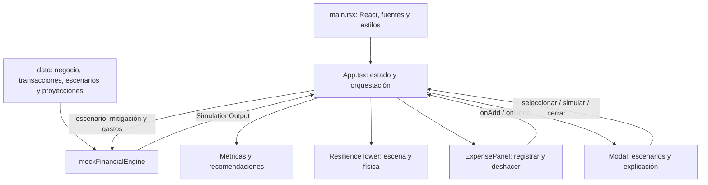
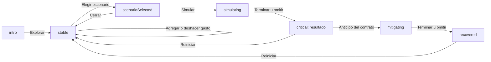

# Resilia — Documentación de la sesión y arquitectura

> **Estado al cierre de la sesión:** demo funcional con torre **3D**, registro de gastos, escenarios financieros y mitigación. Interfaz exclusivamente light. Datos y resultados analíticos simulados.
>
> Este documento describe el código existente y el trabajo realizado. Las mejoras futuras se identifican expresamente; no deben interpretarse como funcionalidades implementadas.

## 1. Producto y propósito

**Resilia** permite explorar el efecto de una decisión sobre la liquidez de una PyME antes de ejecutarla.

**Subtítulo:** «Decide hoy sin comprometer el mañana de tu negocio».

La idea central es:

> Una decisión puede ser rentable y aun así dejar al negocio sin efectivo antes de recibir sus ingresos.

La demo está diseñada para **Mariana**, dueña de **Distribuidora Luna**, con 12 empleados. Su negocio paga inventario y nómina antes de cobrar facturas y depende de pocos clientes grandes. La decisión principal consiste en aceptar un contrato con cobro a 60 días.

La torre representa el soporte financiero del negocio. Sus bloques son una metáfora visual de liquidez, ingresos, gastos y obligaciones; no constituyen una reproducción contable exacta.

### Alcance implementado

- Introducción sin login y acceso al dashboard.
- Métricas financieras y contexto del negocio.
- Torre 3D interactiva de 12 niveles y 36 bloques.
- Tres escenarios predefinidos.
- Secuencia de decisión, retraso, riesgo, colapso y mitigación.
- Registro de gastos adicionales, historial resumido y deshacer.
- Reinicio de la simulación.
- Explicación técnica ilustrativa.
- Diseño responsive, movimiento reducido y alternativa sin WebGL.
- Datos tipados, motor mock central, pruebas y build de producción.

### Fuera del alcance actual

No se implementaron backend, autenticación, base de datos, persistencia de los gastos, conexión efectiva a Nessie, homología persistente real ni predicción de quiebras. La aplicación no realiza operaciones financieras ni modifica cuentas reales.

## 2. Evolución durante la sesión

| Etapa | Trabajo realizado | Resultado |
| --- | --- | --- |
| Inspección inicial | Se revisó el repositorio, que estaba vacío. | Se creó una base React + TypeScript + Vite. |
| Primera versión | Se construyeron la interfaz light, datos, motor mock, torre 3D y escenarios. | Demo con el recorrido contrato → riesgo → colapso → anticipo. |
| Validación inicial | Se instalaron dependencias, se ejecutó el proyecto y se probaron vistas y flujos. | Se corrigieron problemas de compilación, compatibilidad y física. |
| Refinamiento 2D | A petición del usuario, la torre se sustituyó temporalmente por SVG animado. Se añadió la captura de gastos. | Cada gasto retiraba soporte, con deshacer y actualización de métricas. |
| Regreso a 3D | Se restauraron Three.js, React Three Fiber, Drei y Rapier. | Se conservaron las mejoras de gastos dentro de la experiencia 3D. |
| Documentación | Se actualizó el README y se redactó este documento. | Guía para usar, entender y continuar el proyecto. |

**La versión vigente es 3D.** La versión SVG fue una etapa intermedia, no un modo alternativo seleccionable. No existe selector entre 2D y 3D ni selector de tema.

## 3. Diseño de la experiencia

### Identidad visual

- Fondo claro y superficies blancas.
- Texto principal azul marino y texto secundario gris azulado.
- Azul financiero como color principal.
- Verde para cobros y señales positivas.
- Amarillo para incertidumbre y advertencias.
- Coral para obligaciones y fragilidad.
- Bordes discretos, radios moderados y sombras suaves.
- Fuente **Inter**, con pesos 400, 500, 600 y 700, instalada mediante `@fontsource/inter` y servida localmente.
- Iconos de Lucide React y transiciones de interfaz con Framer Motion.
- Etiqueta visible: **«Demo con datos simulados»**.

No se utilizaron imágenes generadas, Google Fonts ni assets remotos para construir la experiencia. La escena se compone de geometría, materiales y luces.

### Distribución

En escritorio, la información y los controles aparecen a la izquierda. La torre ocupa la derecha y usa posicionamiento sticky para acompañar la interacción al desplazarse.

En móvil, el orden es: contexto y métricas, torre, captura de gastos y escenarios. Al iniciar ciertas simulaciones o agregar un gasto, la interfaz desplaza la vista hacia la torre para mostrar el efecto.

Los detalles de escenarios se presentan mediante un diálogo nativo: panel lateral en escritorio y bottom sheet en móvil.

## 4. Stack y dependencias

Las versiones siguientes corresponden a las declaradas en `package.json` al redactar este documento.

| Tecnología | Versión | Responsabilidad |
| --- | --- | --- |
| React / React DOM | 19.1.1 | Componentes y estado de la interfaz |
| TypeScript | 5.9.2 | Tipos y comprobación estática |
| Vite | 7.3.6 | Desarrollo local y build |
| Three.js | 0.180.0 | Renderizado 3D |
| `@react-three/fiber` | 9.3.0 | Integración declarativa entre React y Three.js |
| `@react-three/drei` | 10.7.6 | `OrbitControls` y `RoundedBox` |
| `@react-three/rapier` | 2.2.0 | Cuerpos rígidos y colapso físico |
| Tailwind CSS / plugin Vite | 4.1.13 | Integración de estilos; complementada con CSS propio |
| Framer Motion | 12.23.12 | Transiciones de interfaz |
| Lucide React | 0.468.0 | Iconos |
| `@fontsource/inter` | 5.2.8 | Tipografía local |
| Playwright Test | 1.55.1 | Pruebas de navegador |
| `tsx` | 4.20.5 | Ejecución de pruebas TypeScript con Node |
| Prettier | Rango `^3.6.2` | Formato de código |

Se conservan `package-lock.json` y `pnpm-lock.yaml`. Es preferible elegir un gestor por instalación y evitar alternarlos sobre el mismo `node_modules`, porque durante la sesión esa mezcla produjo resoluciones y ejecutables inconsistentes.

## 5. Estructura del repositorio

```text
.
├── DOCUMENTACION_SESION.md
├── README.md
├── index.html
├── package.json
├── package-lock.json
├── pnpm-lock.yaml
├── pnpm-workspace.yaml
├── tsconfig.json
├── vite.config.ts
├── playwright.config.ts
├── src/
│   ├── main.tsx
│   ├── App.tsx
│   ├── styles.css
│   ├── components/
│   │   ├── ResilienceTower.tsx
│   │   ├── ExpensePanel.tsx
│   │   └── Modal.tsx
│   ├── data/
│   │   ├── types.ts
│   │   ├── business.ts
│   │   ├── transactions.ts
│   │   ├── scenarios.ts
│   │   └── projections.ts
│   └── lib/
│       ├── mockFinancialEngine.ts
│       └── mockFinancialEngine.test.ts
├── tests/
│   └── demo.spec.ts
└── dist/                         # Generado por el build
```

Las dependencias, los resultados de pruebas y los archivos generados indicados en `.gitignore` no forman parte del código fuente a mantener.

## 6. Arquitectura general

La aplicación es una SPA de una sola experiencia. No tiene router, servidor propio, store externo ni capa de persistencia. El estado compartido reside en `App.tsx`; los resultados financieros se derivan mediante el motor mock.



El motor decide los resultados de la demo. La torre interpreta esos resultados visualmente. La física no calcula la fragilidad ni la supervivencia.

### Responsabilidades por módulo

| Archivo | Responsabilidad actual |
| --- | --- |
| [src/main.tsx](src/main.tsx) | Monta React en `#root`, activa `StrictMode` e importa Inter y estilos. |
| [src/App.tsx](src/App.tsx) | Orquesta introducción, dashboard, métricas, escenarios, cronología, resultados, mitigación y explicación técnica. Mantiene el estado compartido. |
| [src/components/ResilienceTower.tsx](src/components/ResilienceTower.tsx) | Renderiza la torre, controla la física y los colores, permite inspeccionar bloques y ofrece fallback textual. |
| [src/components/ExpensePanel.tsx](src/components/ExpensePanel.tsx) | Formulario de gastos, accesos rápidos, total acumulado, últimas entradas y deshacer. |
| [src/components/Modal.tsx](src/components/Modal.tsx) | Diálogo nativo reutilizable, cierre con Escape, botón y fondo; restaura el foco. |
| [src/lib/mockFinancialEngine.ts](src/lib/mockFinancialEngine.ts) | Calcula resultados mock, impacto de gastos, proyecciones, cambios de torre y recomendaciones. También exporta `money()`. |
| [src/data/types.ts](src/data/types.ts) | Contratos de datos y tipos compartidos. |
| [src/data/business.ts](src/data/business.ts) | Negocio de ejemplo y proveedor asíncrono mock. |
| [src/data/transactions.ts](src/data/transactions.ts) | Genera las 40 transacciones de ejemplo. |
| [src/data/scenarios.ts](src/data/scenarios.ts) | Catálogo de decisiones y detalles mostrados al usuario. |
| [src/data/projections.ts](src/data/projections.ts) | Trayectorias predeterminadas de saldo para 12 semanas. |
| [src/styles.css](src/styles.css) | Diseño light, layouts, componentes visuales y reglas responsive. |
| [vite.config.ts](vite.config.ts) | Plugins React/Tailwind y separación de chunks de Three.js y física. |

**Grado de modularización:** existen componentes reutilizables para la torre, gastos y diálogos. Las métricas, resultados, selección de escenarios y explicación técnica todavía se renderizan principalmente dentro de `App.tsx`; no se crearon archivos separados para todos los componentes sugeridos en el brief inicial.

## 7. Estado y flujo de la aplicación

### Estados explícitos

| Estado | Significado en la interfaz |
| --- | --- |
| `intro` | Pantalla inicial y negocio seleccionado |
| `stable` | Dashboard base; también permite registrar gastos |
| `scenarioSelected` | Detalles de un escenario abiertos |
| `simulating` | Secuencia temporal de simulación |
| `critical` | Resultado de un escenario terminado |
| `mitigating` | Aplicación del anticipo |
| `recovered` | Resultado posterior a la mitigación |

**Distinción importante:** `AppState` expresa la etapa del flujo, mientras que `SimulationOutput.status` expresa el riesgo financiero. El estado de interfaz `critical` también se utiliza al terminar los escenarios de equipo o retraso, aunque su resultado financiero sea «Precaución». Igualmente, gastos manuales pueden volver crítico el resultado mientras el flujo sigue en `stable`.



### Estado complementario

- `expenses`: gastos simulados acumulados, almacenados en memoria.
- `scenario`: escenario seleccionado.
- `progress`: avance entre 0 y 1.
- `resetKey`: fuerza la reconstrucción de la escena cuando corresponde.
- `skipAnimation`: indica que se solicitó el resultado inmediato.
- `technical`: controla el panel de explicación.
- `reduced`: preferencia de movimiento reducido del dispositivo.

`starting` calcula la referencia con los gastos actuales y sin escenario. `beforeMitigation` calcula el escenario antes del anticipo. Se usan para que las comparaciones y transiciones no vuelvan siempre a los valores iniciales cuando ya se han agregado gastos.

El reinicio limpia gastos, escenario y progreso, y vuelve al dashboard. Recargar la página también pierde los gastos, ya que no hay persistencia.

## 8. Modelo de datos

### Tipos principales

| Tipo | Campos o propósito |
| --- | --- |
| `Business` | Identificador, nombre, propietaria, empleados, saldo y concentración |
| `FinancialTransaction` | Fecha, monto, dirección, categoría, contraparte, estado y confianza |
| `Scenario` | Identificador de decisión, título, descripción, monto y detalles |
| `WeeklyProjection` | Semana, saldo, ingresos y gastos |
| `TowerChange` | Semana y acción visual: retirar liquidez, agregar ingreso, retrasar ingreso o agregar liquidez |
| `SimulatedExpense` | Identificador, categoría y monto de un gasto introducido por el usuario |
| `SimulationOutput` | Métricas, proyecciones, cambios visuales, recomendación, riesgo y acumulado de gastos |
| `FinancialDataSource` | Métodos asíncronos `getBusiness()` y `getTransactions()` |

Las transacciones cubren nómina, renta, inventario, servicios, crédito, cobros, impuestos, transporte y mantenimiento. Se generan 40 registros entre septiembre y diciembre de 2026, con importes y estados repetibles. Son fixtures, no un extracto bancario real.

`mockDataSource` implementa el contrato asíncrono del proveedor. **La UI todavía importa `business` y `transactions` directamente**: el adaptador existe como punto de extensión, pero aún no gobierna la carga de datos de la aplicación.

Los gastos manuales usan identificadores creados con `crypto.randomUUID()`. Esos identificadores no afectan los cálculos: mismos importes y escenarios producen los mismos resultados financieros.

## 9. Motor financiero mock

### Interfaz pública

```typescript
simulateFinancialDecision(
  business: Business,
  transactions: FinancialTransaction[],
  scenario: Scenario | null,
  mitigations: string[] = [],
  expenses: SimulatedExpense[] = [],
): SimulationOutput
```

El motor valida que haya transacciones, que el saldo sea finito y que los gastos adicionales tengan importes positivos y finitos. La UI agrega sus propias restricciones de entrada.

**Cómo funciona realmente:** selecciona una trayectoria predeterminada de `projections.ts`, toma métricas base de una tabla y aplica reglas aritméticas para los gastos adicionales. No reconstruye el flujo financiero a partir de las 40 transacciones. El parámetro `transactions` se conserva como contrato de integración y se valida que no esté vacío.

### Resultados base, sin gastos adicionales

| Escenario | Fragilidad | Supervivencia | Buffer recomendado | Saldo mínimo proyectado | Riesgo |
| --- | ---: | ---: | ---: | ---: | --- |
| Situación inicial | 31 | 14 semanas | $24,000 | $156,000 | Estable |
| Contrato y retraso automático | 78 | 7 semanas | $96,000 | −$96,000 | Crítico |
| Contrato con anticipo del 40% | 43 | 12 semanas | $18,000 | $32,000 | Precaución |
| Comprar equipo | 49 | 10 semanas | $42,000 | $92,000 | Precaución |
| Retraso de cliente | 64 | 8 semanas | $72,000 | $4,000 | Precaución |

Todos los importes son MXN. El dashboard también muestra saldo inicial de $280,000, nómina de $72,000 en seis días y concentración del principal cliente de 42%.

### Reglas de gastos manuales

Si `G` es la suma de gastos agregados:

```text
saldo disponible mostrado = saldo del negocio − G

bloques retirados por gastos =
  mínimo(35, suma(máximo(1, techo(monto del gasto / 24,000))))

fragilidad = mínimo(100, fragilidad base + redondeo(G / 3,000))

supervivencia = máximo(0, semanas base − techo(G / 20,000))

saldo proyectado por semana =
  saldo de la trayectoria + saldo del negocio − 280,000 − G

buffer recomendado =
  máximo(buffer base + redondeo(G × 0.15), −saldo mínimo proyectado)
```

Los gastos adicionales se cargan a la primera semana para mantener la identidad de caja:

```text
saldo anterior + ingresos − gastos = saldo de la semana
```

El riesgo es «Crítico» si la fragilidad alcanza 70 o si el saldo mínimo es negativo; «Precaución» desde 40; «Estable» en otro caso.

Estas fórmulas son reglas de demostración, no un modelo calibrado ni una recomendación financiera validada. La categoría del gasto sirve para identificarlo en la interfaz; no modifica su tratamiento analítico actual.

### Ejemplo reproducible

Agregar $24,000, luego $72,000 y después $95,000, sin escenario predefinido, produce:

| Métrica | Resultado |
| --- | ---: |
| Gastos acumulados | $191,000 |
| Saldo disponible | $89,000 |
| Bloques retirados | 8 |
| Fragilidad | 95 |
| Supervivencia | 4 semanas |
| Buffer recomendado | $52,650 |
| Saldo mínimo proyectado | −$35,000 |

Aunque todavía hay saldo disponible, la proyección presenta un faltante futuro. Esa diferencia es la razón narrativa para el colapso.

### Semántica de la semana crítica

`criticalWeek` señala la semana con **el saldo más bajo**, siempre que sea negativo. No representa necesariamente la primera semana sin liquidez. En el contrato, la primera proyección negativa ocurre en la semana 6 y el mínimo de −$96,000 ocurre en la semana 7, que es la «Semana crítica» mostrada.

La supervivencia es otra métrica mock y no se deduce directamente de esa primera semana negativa. Hay 12 semanas de proyección, aunque la situación inicial indique 14 semanas de supervivencia; no existe una extrapolación real detrás de ese valor.

## 10. Escenarios y narrativa

### Aceptar nuevo contrato

- Inversión inicial: $180,000.
- Ingreso esperado: $320,000.
- Cobro a 60 días.
- Margen estimado mostrado: 28%.

El margen es un dato del escenario, no el resultado de restar solamente inversión inicial e ingreso. El panel aclara que hay otros costos del contrato.

La animación de interfaz dura aproximadamente ocho segundos. El progreso cambia los mensajes, retira soporte inicial, colorea cobros futuros, introduce un retraso de 30 días y activa el colapso. El resultado explica que rentabilidad y liquidez no son equivalentes.

### Mitigación

«Aplicar anticipo del 40%» activa la mitigación `advance40`, con una transición de aproximadamente 1.8 segundos. Se reconstruye la escena y se refuerzan visualmente las primeras semanas.

Si existen gastos adicionales que el anticipo no cubre, la UI no presenta la recuperación como suficiente: puede mostrar «El anticipo aún no cubre tus gastos» y mantener un resultado crítico.

### Escenarios alternativos

- **Comprar equipo:** $110,000 iniciales, ahorro mensual ilustrativo de $18,000 y recuperación indicada de siete meses.
- **Retraso de cliente:** cobro afectado de $160,000, retraso de 30 días y concentración de 42%.

Ambos tienen resultado y recomendación propios. No toda simulación produce un colapso.

## 11. Torre 3D y física

### Componentes internos

`ResilienceTower.tsx` contiene:

- `ResilienceTower`: adapta métricas y estado a la escena; detecta WebGL y gestiona el detalle de bloques.
- `SceneBoundary`: captura errores de renderizado y ofrece una alternativa textual.
- `Scene`: agrupa los cuerpos, aplica balanceo y controla la duración del colapso.
- `Block`: crea un bloque con geometría redondeada y cuerpo rígido.

### Construcción visual

- 12 niveles, tres bloques por nivel.
- Orientación alternada de 90 grados.
- Geometría aproximada por bloque: `0.72 × 0.44 × 2.3` unidades.
- Materiales con rugosidad y metalizado discretos.
- Plano claro, luz ambiental, luz direccional cálida, sombras y niebla suave.
- Cámara en perspectiva y `OrbitControls`, con desplazamiento lateral deshabilitado y zoom limitado.
- DPR limitado al rango 1–1.5 y mapa de sombras de 1024 × 1024.

| Color | Significado |
| --- | --- |
| Azul | Liquidez disponible |
| Verde | Cobros esperados |
| Gris | Gastos operativos |
| Coral | Obligaciones |
| Amarillo | Cobros retrasados o inciertos |

Los detalles al tocar un bloque son representativos: semana, concepto, importe y estado. No están enlazados uno a uno con las transacciones mock.

### Retirada y caída

Los bloques perdidos combinan gastos manuales y cambios del escenario, con un máximo de 35. La escena omite esos cuerpos y ajusta la altura de los restantes según niveles retirados.

En situación estable, los cuerpos son fijos y el grupo presenta un balanceo leve. Al colapsar, pasan a dinámicos y reciben velocidades lineales y angulares definidas para hacer visible la caída.

- Gravedad: `[0, -9.81, 0]`.
- Paso físico: `1/60`.
- Fricción: `0.65`.
- Restitución: `0.12`.
- La simulación física se pausa aproximadamente 2.8 segundos después de activarse el colapso.

Los gastos manuales provocan colapso cuando el saldo mínimo proyectado es negativo. Para los escenarios, el colapso se activa en la fase final correspondiente si el resultado es crítico.

El estado y los parámetros financieros son deterministas. La física es una representación controlada; no se garantiza una trayectoria idéntica de cada bloque entre dispositivos o tasas de renderizado.

### Reinicio, omisión y recuperación

`resetKey` y el número de bloques perdidos por gastos forman la clave del `Canvas`, de modo que se reconstruyen cámara y cuerpos cuando corresponde. El detalle seleccionado también se limpia.

Al omitir la animación o usar movimiento reducido, el estado crítico puede representarse mediante una disposición estática de bloques caídos. No es necesario ejecutar toda la física para conocer el resultado.

## 12. Captura de gastos

El formulario permite elegir nómina, inventario, renta, servicios, crédito, impuestos, transporte, mantenimiento u otro gasto.

- Monto requerido, positivo y finito.
- Control numérico de 1 a 10,000,000 MXN, con paso de un peso.
- Accesos rápidos: nómina de $72,000, inventario de $95,000 y renta de $24,000.
- Total acumulado y contador de gastos.
- Visualización de las últimas tres entradas, aunque todos los gastos permanecen en el cálculo.
- «Deshacer último gasto» revierte la última entrada.
- Controles deshabilitados mientras se ejecuta una simulación o mitigación.

El saldo del objeto `business` no se modifica: el valor mostrado se deriva del saldo inicial menos el acumulado. Esto facilita deshacer y reiniciar sin alterar los datos base.

## 13. Accesibilidad y rendimiento

### Implementado

- Formularios con etiquetas y controles nativos.
- Diálogo HTML con gestión nativa del foco, Escape y restauración del foco anterior.
- Texto accesible con estado de la torre y bloques retirados.
- Resultados e historial con regiones de actualización anunciables.
- Ruta de simulación accesible mediante teclado.
- Preferencia de movimiento reducido aplicada a la torre y los tiempos de simulación.
- Botón para omitir la secuencia.
- Detección preventiva de WebGL2 y fallback textual.
- Fuentes locales, recursos locales y ausencia de llamadas de negocio externas.
- División de chunks de Three.js y del runtime de física en el build.

### Límites de la validación

No se realizó una auditoría formal WCAG, un benchmark de FPS en teléfonos físicos ni una validación exhaustiva con lectores de pantalla. La inspección individual de bloques 3D es principalmente por puntero; la alternativa textual permite conocer el estado financiero sin operar la escena.

La versión 2D temporal redujo el bundle al retirar la escena 3D. Al restaurarla volvieron las dependencias gráficas y físicas. El build final puede advertir chunks mayores de 500 kB; esto no impide la compilación, pero el peso sigue siendo una oportunidad de optimización.

## 14. Instalación y ejecución

### npm

```sh
npm install
npm run dev
```

### pnpm

```sh
pnpm install
pnpm dev
```

La base de herramientas utilizada requiere Node.js 20.19+ o 22.12+. Vite imprime la URL disponible; si el puerto está ocupado, puede seleccionar otro.

La última URL de demo utilizada durante la sesión fue `http://localhost:5174/`. Es una dirección local, no una publicación en internet ni una garantía de que el proceso continúe activo después de cerrar el entorno.

Para solicitar ese puerto:

```sh
npm run dev -- --port 5174
```

### Build de producción

```sh
npm run build
```

El comando ejecuta `tsc -b` y después `vite build`. Los artefactos quedan en `dist/`.

Para revisar el build localmente:

```sh
npx vite preview --host 127.0.0.1 --port 4173
```

No se desplegó la aplicación a un hosting público durante esta sesión.

## 15. Pruebas y validaciones realizadas

### Pruebas del motor

Archivo: [src/lib/mockFinancialEngine.test.ts](src/lib/mockFinancialEngine.test.ts).

```sh
npm test
```

Utiliza el runner de Node con `tsx`. Los dos casos verifican:

1. Valores base, resultado del contrato, mitigación, determinismo, cantidad de transacciones, horizonte de 12 semanas e identidad de caja.
2. Acumulación de gastos, pérdida de bloques, aumento de fragilidad, faltante futuro, coherencia de caja y rechazo de gastos inválidos.

### Pruebas de navegador

Archivo: [tests/demo.spec.ts](tests/demo.spec.ts).

```sh
npx playwright install chromium
npm run test:e2e
```

El servidor debe estar activo. Para un puerto diferente:

```sh
PLAYWRIGHT_BASE_URL=http://localhost:5174 npm run test:e2e
```

`PLAYWRIGHT_EXECUTABLE_PATH` permite indicar un Chromium ya instalado. Se utilizó esa opción durante la sesión para evitar otra descarga de navegador.

La configuración define dos proyectos:

| Proyecto | Viewport | Configuración |
| --- | --- | --- |
| `desktop` | 1440 × 1100 | Navegador de escritorio |
| `mobile` | 390 × 844 | Emulación móvil e interacción táctil |

Cuatro casos se ejecutan en ambos proyectos, para un total de ocho:

1. Entrada, contrato, retraso automático, resultado, anticipo, recuperación, reinicio, escenarios alternativos y panel técnico.
2. Recorrido por teclado con movimiento reducido.
3. Simulación sin WebGL y omisión de animaciones.
4. Captura de gastos, estado de colapso, deshacer y reinicio.

El recorrido principal recoge errores de consola y de página y comprueba que no existan solicitudes fuera del origen local, salvo recursos `data:` y `blob:`. También hay comprobaciones de desbordamiento horizontal.

**Resultado registrado tras restaurar 3D:** build correcto, dos pruebas del motor aprobadas y ocho pruebas de navegador aprobadas. Se revisaron capturas de las vistas móvil y escritorio. Las capturas de prueba se escriben en `/tmp`; son evidencias temporales, no assets de la aplicación.

Las aserciones de la suite final comprueban estado accesible, resultados y presencia del canvas; no certifican físicamente cada colisión. La caída también fue inspeccionada visualmente durante el desarrollo.

Esta actualización documental no ejecuta de nuevo la suite: describe las validaciones efectuadas durante la implementación.

## 16. Problemas encontrados y resueltos

| Problema | Resolución aplicada |
| --- | --- |
| Versiones de React y librerías 3D con rangos incompatibles | Se fijaron versiones compatibles para la demo. |
| Framer Motion resolvía una versión incompatible de `motion-dom` | Overrides: `motion-dom` 12.23.12 y `motion-utils` 12.23.6. |
| Diferencias entre instalaciones npm y pnpm | Se conservaron las restricciones en ambos gestores y se sincronizaron lockfiles. |
| Scripts de instalación de esbuild y Tailwind pendientes en pnpm | Se habilitaron en `pnpm-workspace.yaml`. |
| Operaciones físicas sobre referencias retiradas | Se ajustó el ciclo de vida de cuerpos y se verificó validez y tipo dinámico antes de aplicar movimiento. |
| Colapso poco visible | Se ajustaron soporte, velocidades y duración de la caída. |
| Fallback de WebGL no visible en algunos casos | Se añadió detección previa y una alternativa textual fuera del canvas. |
| Ejecutable Playwright inconsistente tras mezclar instalaciones | `test:e2e` utiliza directamente el CLI de `@playwright/test`. |
| Cambios de dependencias y servidores locales antiguos | Se reinició Vite con la instalación vigente y se repitieron verificaciones. |

Las auditorías de dependencias ejecutadas después de los ajustes reportaron cero vulnerabilidades en ese momento. Esto es un resultado histórico de la sesión, no una garantía permanente.

## 17. Integraciones futuras

### Capital One Nessie

Punto de entrada: `FinancialDataSource` y `mockDataSource`.

Trabajo pendiente:

1. Implementar un proveedor que adapte cuentas y transacciones al modelo tipado.
2. Cambiar la carga de `App.tsx` para consumir el proveedor asíncrono.
3. Agregar estados de carga, error y ausencia de datos.
4. Normalizar fechas, monedas, categorías, confianza y estados.
5. Definir una capa segura para credenciales y autorización; no colocar secretos en el bundle del navegador.

La etiqueta «Datos simulados desde Capital One Nessie» forma parte del relato de la demo. No significa que los datos actuales procedan de una consulta a Nessie.

### Motor TDA

Punto de entrada: comentarios e interfaz de salida en `mockFinancialEngine.ts`.

Pendiente: representación de series, cálculo topológico, calibración, validación y traducción de señales a métricas interpretables. El diagrama del panel técnico es ilustrativo y no procede de un cálculo de persistencia.

### Simulación de caja real

Debe sustituir las trayectorias fijas y las reglas de gastos por una proyección a partir de cobros y pagos fechados. Conviene mantener un contrato equivalente a `SimulationOutput` para reducir cambios en la interfaz.

Antes de hacerlo, deben definirse con precisión supervivencia, primera semana de faltante, semana de mayor déficit, buffer y relación entre señal estructural y fragilidad.

## 18. Límites actuales y siguientes pasos sugeridos

Estos puntos están documentados como pendientes, no como trabajo realizado:

- Separar métricas, resultados, escenarios y explicación técnica de `App.tsx` si crece la aplicación.
- Distinguir mejor el estado de flujo `critical` del estado financiero crítico, por ejemplo renombrándolo a `result` en una futura refactorización.
- Extraer un adaptador de presentación para que las reglas de color, bloques y colapso no residan directamente en la escena.
- Incorporar navegación por teclado para consultar semanas y bloques individuales.
- Validar contraste y accesibilidad con herramientas específicas y usuarios.
- Perfilar renderizado y consumo de memoria en teléfonos físicos.
- Revisar carga diferida del módulo 3D y optimización de assets físicos.
- Limpiar estilos residuales de la etapa 2D; no implican que exista un segundo modo funcional.
- Añadir persistencia, exportación o autenticación solamente si pasan a formar parte del alcance del producto.
- Reemplazar reglas mock únicamente cuando existan definiciones analíticas y datos adecuados para validarlas.

## 19. Guion breve de demostración

1. Abrir Resilia y entrar a Distribuidora Luna.
2. Explicar la torre y los valores iniciales: 31 de fragilidad y 14 semanas de supervivencia.
3. Agregar un gasto o usar un acceso rápido para mostrar que consumir liquidez retira soporte.
4. Deshacer o reiniciar para recuperar la situación inicial.
5. Simular el contrato de $180,000 con cobro a 60 días.
6. Observar el retraso automático y el resultado de −$96,000 en la semana crítica.
7. Aplicar el anticipo del 40% y mostrar la recuperación a 43 de fragilidad y 12 semanas.
8. Aclarar que todos los datos son simulados y que el producto ayuda a explorar decisiones, sin afirmar que predice quiebras.

---

**Documento relacionado:** [README de instalación y uso](README.md).
