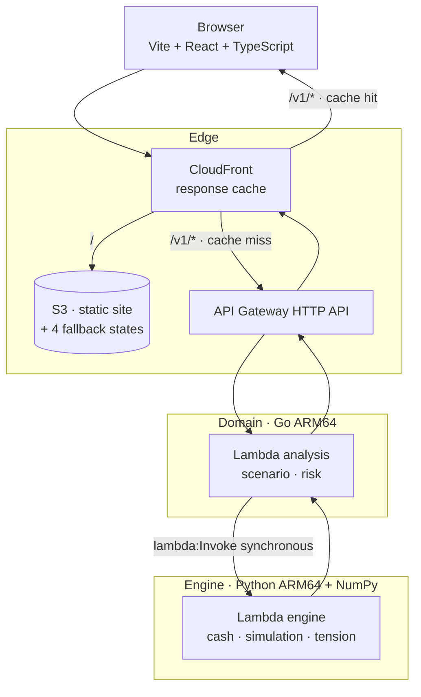
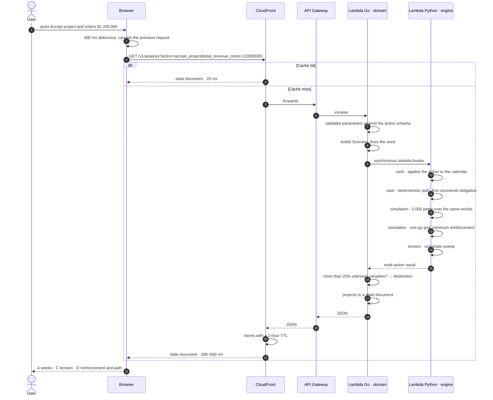
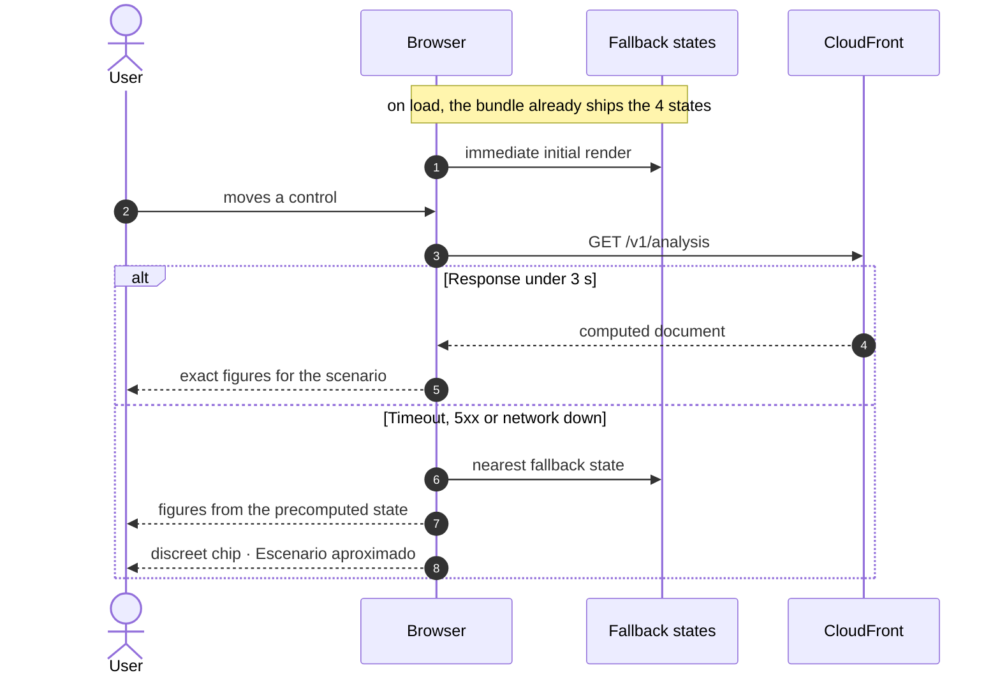
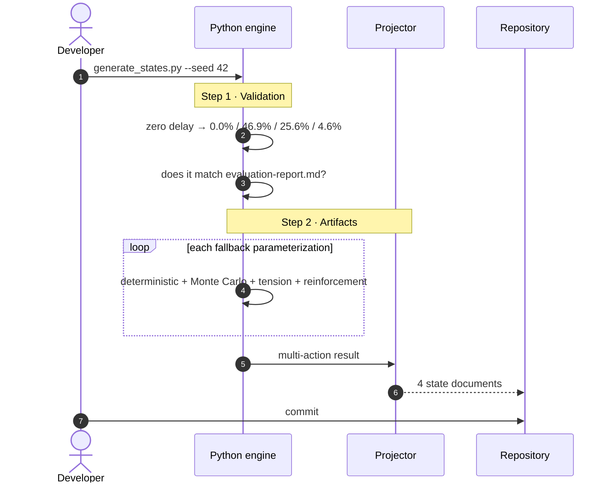
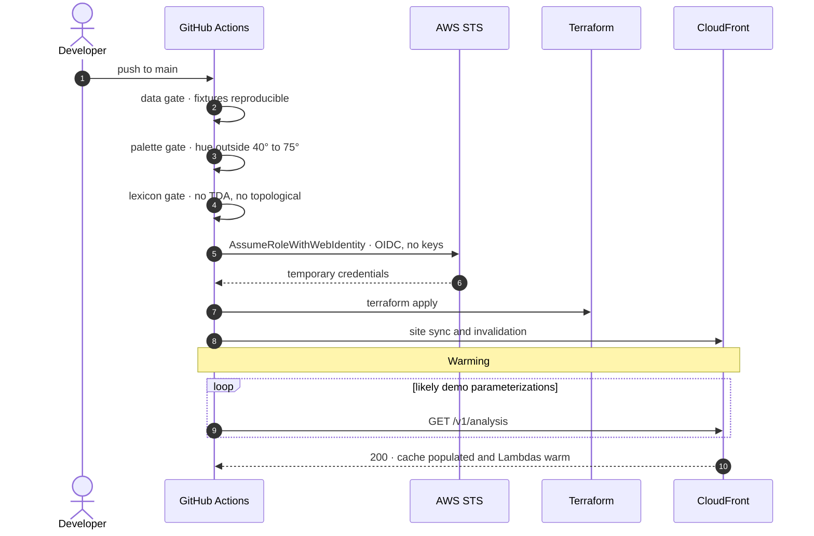

# Architecture — Structural Fragility Engine for SMEs

Infrastructure, domain and deployment design for the system described in
`product-vision.md`, scoped to `prd-mvp.md`, with `evaluation-report.md` as the
evidence baseline.

Context: hackathon, fresh AWS account with 100 USD of credit, small team. The
system must accept **arbitrary user parameters** across five business decisions
and answer with an analysis computed live.

---

## 1. The principle that orders everything else

The user enters free amounts, terms and percentages. No table of states covers
that space, so the engine runs on every request.

But the engine has one property that changes everything:

> **It is deterministic given a fixed seed. The response is a pure function of
> its input parameters.**

Three decisions follow, and together they make a live backend viable during a
hackathon:

1. **The response is cacheable.** CloudFront memoizes each parameterization. The
   second visitor to a given scenario never reaches the computation.
2. **Cold start only affects the first visitor to each parameterization**, and the
   deployment pre-warms the ones that matter.
3. **The precomputed states survive** as the initial render and as a safety net if
   the API fails. The demo degrades; it does not die.

---

## 2. Architecture decisions

| # | Decision | Reason | Rejected alternative |
| --- | --- | --- | --- |
| 1 | **`GET` with query parameters, not `POST`** | A `POST` cannot be cached at the CDN; a deterministic `GET` can | `POST /v1/analysis` |
| 2 | **CloudFront as the engine's memory** | Pure response ⇒ long, correct TTL. Turns the CDN into a memo table | Application-level cache |
| 3 | **Go on the critical path: domain and ACL** | The invariants live here; NumPy vocabulary never crosses into the domain | Python exposed directly |
| 4 | **Python with NumPy only, zip packaging, no container** | The PRD excludes CatBoost from the MVP; without it cold start drops from 3–8 s to about 1 s | Container image in ECR |
| 5 | **Synchronous, no queue** | One parameterization answers in hundreds of milliseconds | SQS + async worker |
| 6 | **The five actions share a domain interface** | The first one costs; the other four are about 20 lines each | Five loose implementations |
| 7 | **Forms generated from the action schema** | Adding an action does not touch the front-end | Five hand-written forms |
| 8 | **Precomputed states as fallback, not as mechanism** | Instant initial render and a circuit breaker against API failure | Depending on the API alone |
| 9 | **No VPC, no NAT Gateway** | NAT is roughly 32 USD/month: a third of the budget on network plumbing | Lambdas in a private VPC |
| 10 | **No database inside AWS** | The analysis is pure and persists nothing. The ledger does persist, on Tiger Cloud (PostgreSQL + TimescaleDB) reached over TLS, so there is still no RDS, no Aurora and no VPC | DynamoDB / RDS / Aurora |
| 11 | **GitHub Actions with OIDC** | Zero static keys in the repository | Access keys in secrets |
| 12 | **Terraform with S3 backend + native lockfile** | Since TF 1.10 no DynamoDB table is needed for locking | DynamoDB locking |

---

## 3. Overview



**Expected latency**, with a warm Lambda: 300–600 ms end to end. On a CloudFront
cache hit: 20–40 ms. Only the first visitor to a new parameterization pays the
cold start, and section 10 bounds it.

---

## 4. Sequences

### 4.1 Request with arbitrary parameters



### 4.2 Degradation on failure

The demo cannot depend on the network cooperating.



The fallback **does not lie**: it shows a real precomputed state and declares it.
That is preferable to a blank screen in front of the jury.

### 4.3 Phase 0 — Generating the fallback states and fixtures



These artifacts serve three purposes: initial render, fallback on failure, and
**golden fixtures** that the CI gate uses to verify the engine is still
reproducible.

### 4.4 Deployment and warming



Warming does two things at once: it keeps the Lambdas warm and it **populates the
CloudFront cache** with the scenarios the pitch will walk through. Rehearsed
paths answer in 20 ms even the first time someone opens them at the event.

---

## 5. The five decisions

`product-vision.md` §8 defines actions as transformations of the cash calendar.
That is exactly the domain model.

### 5.1 The interface

```go
// internal/scenario/domain/action.go
type Action interface {
    Kind() ActionKind
    Validate() error                           // its own invariants
    Apply(kernel.Calendar) kernel.Calendar     // the movements it introduces
}
```

An action is an **immutable value object** that produces cash movements. It knows
nothing about Monte Carlo, probabilities, or the interface. That separation is
what lets the second, third, fourth and fifth actions cost about 20 lines each.

### 5.2 The five

| Action | Parameters | Effect on the calendar |
| --- | --- | --- |
| `accept_project` | total revenue, initial cost, advance %, collection days, hires, duration | Immediate outflow for cost; deferred inflow for collection; incremental recurring payroll |
| `extend_credit` | amount, collection days, customer | Defers an inflow; raises concentration if it is the main customer |
| `hire_staff` | headcount, monthly unit cost, start date | Recurring fortnightly outflow from the start date |
| `buy_asset` | amount, % financed, financing term, delivery days | Immediate outflow for the down payment; recurring outflows for the financing |
| `request_financing` | amount, annual rate, term, grace period | Immediate inflow; recurring outflows for debt service |

**Shared invariants**, inherited from the already-tested engine:

- No action increases total revenue: it reschedules it in time.
- No action may produce a movement predating the cut-off date.
- Every action declares its provenance: `declared` by the user, never `learned`.

### 5.3 The schema drives the form

Each action publishes its parameter schema in `contracts/actions.schema.json`:

```json
{
  "accept_project": {
    "label": "Aceptar Proyecto",
    "parameters": [
      {"id":"total_revenue_cents","label":"Ingreso total","type":"money",
       "min":10000000,"max":500000000,"default":80000000},
      {"id":"advance_pct","label":"Anticipo","type":"percentage",
       "min":0,"max":60,"default":0,"mark":{"value":25,"text":"refuerzo mínimo"}},
      {"id":"collection_days","label":"Plazo de cobro","type":"days",
       "min":0,"max":120,"default":60}
    ]
  }
}
```

The front-end **generates the form from the schema**. Go validates against the
same file. Adding an action means adding a schema entry and an `Action`
implementation: zero changes to interface components.

Note that `id` is English and `label` is Spanish — the schema is where the
language boundary sits.

It is also where the slider marks the PRD requires live — the breaking point at
16 days, the minimum reinforcement at 25% — rather than being burned into code.

### 5.4 The HTTP contract

```
GET /v1/analysis
  ?action=accept_project
  &total_revenue_cents=120000000
  &initial_cost_cents=38000000
  &advance_pct=0
  &collection_days=60
  &hires=2
  &collection_delay_days=16
  &main_customer_lost=false
  &capital_injection_cents=0
  &paths=5000
  &seed=42
```

Response: the **state document** from PRD §5.2, identical to the one in the
precomputed artifacts. One schema for the API and for the fallback.

`/v1/analysis` also accepts the profile variables a stored company may be
missing — `payroll_cents`, `main_customer_concentration`,
`contracted_term_days`, `payroll_interval_days`, `average_collection_days`,
`opening_balance_cents`. A declared value fills an unknown and never overwrites
a recorded one, so a company the database knows fully is unaffected by them.
Without them a company below the coverage threshold answers `abstention`, which
is the correct answer rather than a failure.

```
GET /v1/companies?q=PL-5year&outcome=bankrupt&limit=50&offset=0
```

lists the companies available to analyse, with the coverage each one has and
the profile variables a caller must declare for it. The default company leads
the list and is described from its fixture rather than mirrored into
`company_snapshots`, so there is no copy to drift; it is also the only one that
arrives fully described, which is what makes it the sensible default. Like the ledger it is
never cached, and it answers 503 without a database: the service still serves
its default company, there is simply nothing to choose from.

The ledger is the other half of the contract, and it is not cacheable: it
changes whenever someone records a movement.

```
GET  /v1/movements?direction=in&status=delayed&from=2026-09-01&to=2026-09-30
POST /v1/movements   { node, direction, dueDate, amountCents, description? }
```

`GET` answers the company's movements, most recent obligation first. `POST`
answers `201` with the movement as it was stored, `400` for a draft that breaks
an invariant of `docs/data-model.md` §3, `409` for a re-import that conflicts
with a recorded fact, and `503` when the database is unreachable. Both answer
`no-store`: only the analysis is a pure function of its query string.

Rules:

- **Money in cents, integer.** Never floats crossing the boundary.
- **`seed` explicit in the query.** It is part of the cache key: without it the
  response would not be pure.
- **A write never degrades.** The interface may fall back to a precomputed
  answer for a read; a movement is either stored or reported as unsent.
- **`schema` versioned** in the response. An unknown schema is a visible failure,
  never a silent zero.
- **`warnings` always present** and always rendered.

---

## 6. Domains

### 6.1 The split

| Domain | Language | Contents | Status |
| --- | --- | --- | --- |
| `scenario` | **Go** | `Scenario`, the five `Action` types, `Seed`, parameter validation | **New** |
| `risk` | **Go** | `Assessment`, `Abstention`, `Coverage`, projection to the state document | **New** |
| `cash` | **Python** | `CashCalendar`, `Obligation`, `Collection`, deterministic path | **Exists and is tested** |
| `simulation` | **Python** | Monte Carlo, minimum-reinforcement grid, breaking point | **Exists and is tested** |
| `tension` | **Python** | Univariate sweep → `tension[]` | **New** |
| `twin` | — | Six stacks and the five-node path | Reduced to constants |
| `alerts` | — | Episodes and deduplication | Out of MVP scope |

Go takes what has business invariants and does not exist yet. Python keeps what
is already written and tested: rewriting it would be pure cost.

### 6.2 The anti-corruption layer

```go
// internal/risk/adapters/engine/translator.go
// Translates the engine output into domain objects.
// NumPy vocabulary does not cross this boundary.
func (t Translator) ToDomain(r engine.Result) (domain.Assessment, error) {
    coverage := domain.NewCoverage(r.KnownVariables, r.TotalVariables)
    if coverage.Unknown() > 0.20 {
        return domain.Assessment{State: domain.Abstention}, nil
    }
    ...
}
```

**The proof that the DDD is real:** `internal/*/domain/` imports nothing from
`aws-sdk-go-v2` and nothing from the `engine` package. Verifiable with a `grep`
in CI, and worth more than any diagram.

### 6.3 Invariants the domain enforces

| Invariant | Where | Source |
| --- | --- | --- |
| Cash conservation | `cash` | 30 engine tests |
| An unknown balance is never zero | `cash` | Report §2 |
| No future information from the cut-off date | `cash` | Report §4 |
| A committed scenario is immutable; the seed is fixed at creation | `scenario` | Reproducibility |
| Compared actions share the same worlds | `simulation` | Report §3 |
| No action increases total revenue | `scenario` | Report §3 |
| Abstention above 20% unknown variables | `risk` | Report §2 |
| Every probability declares event and horizon | `risk` | Report §1 |
| Tension clamped to [0,1] | `tension` | PRD §3.3 |

---

## 7. Repository layout

pnpm workspaces monorepo. **All code, identifiers, file names and contracts are
written in English; user-facing copy is written in Spanish**, because the product
serves Mexican SMEs. The contract is the boundary: `collection_delay_days` in
JSON, "Retraso en cobranza" on screen.

```
CapitalOne4PyMEs/
├── apps/
│   └── web/                      # Vite + React + TypeScript
│       ├── src/{app,features,entities,shared}/
│       ├── public/states/        # fallback documents
│       └── AGENTS.md             # front-end specific rules
├── services/
│   ├── domain/                   # Go
│   │   ├── cmd/analysis/
│   │   └── internal/
│   │       ├── scenario/{domain,application,adapters}/
│   │       ├── risk/{domain,application,adapters}/
│   │       └── shared/kernel/
│   └── engine/                   # Python + NumPy
│       ├── engine/{cash,simulation,tension}/
│       ├── scripts/generate_states.py
│       └── tests/
├── contracts/
│   ├── actions.schema.json       # the 5 decisions and their parameters
│   └── state.schema.json         # the state document
├── infra/
│   ├── bootstrap/
│   ├── modules/{site,api,compute,cicd,guardrails}/
│   └── envs/prod/
├── docs/
└── .github/workflows/
```

Inside each Go context, strict hexagonal: `domain/` with no external
dependencies, `application/` holding the ports, `adapters/` holding AWS and HTTP.

The front-end follows its own slice architecture with the direction
`app → features → entities → shared`, verified by `pnpm check:boundaries`. It is
independent of the backend's DDD and must not be conflated with it.

---

## 8. Terraform

### Backend

```hcl
terraform {
  required_version = ">= 1.10"
  backend "s3" {
    bucket       = "fragility-tfstate-<suffix>"
    key          = "prod/terraform.tfstate"
    region       = "us-east-1"
    encrypt      = true
    use_lockfile = true   # native S3 locking, no DynamoDB table
  }
}
```

### Modules

| Module | Contents |
| --- | --- |
| `site` | Private S3 bucket, CloudFront, Origin Access Control, ACM certificate |
| `api` | API Gateway HTTP API, the `/v1/*` CloudFront behaviour, cache policy |
| `compute` | Go Lambda, Python Lambda, IAM roles, warming rule |
| `cicd` | GitHub OIDC provider, least-privilege deploy role |
| `guardrails` | AWS Budgets with alerts, error and duration alarms |

### The cache policy is the important piece

```hcl
resource "aws_cloudfront_cache_policy" "analysis" {
  name        = "deterministic-analysis"
  default_ttl = 3600
  max_ttl     = 86400
  min_ttl     = 60

  parameters_in_cache_key_and_forwarded_to_origin {
    query_strings_config {
      query_string_behavior = "all"   # every parameter forms the key
    }
    headers_config        { header_behavior = "none" }
    cookies_config        { cookie_behavior = "none" }
    enable_accept_encoding_gzip = true
  }
}
```

`query_string_behavior = "all"` is correct **because the response is
deterministic**. With an unseeded stochastic engine, caching would be a bug. Here
it is the optimization that carries the demo.

### Rules

- **Region `us-east-1`.** Lowest pricing, and CloudFront requires the ACM
  certificate there.
- **Everything `arm64`.** Graviton is about 20% cheaper; Go and NumPy run well.
- **Private site bucket**, reachable only through OAC. Never public website
  hosting.
- **Log groups declared in Terraform** with `retention_in_days = 7`. Created by
  Lambda, they default to infinite retention.
- **Least privilege:** Go may invoke exactly one Python function.
- **AWS Budgets** with alerts at 20 / 50 / 80 USD.
- **CloudFront invalidation** on every deploy. Without it the previous version
  keeps being served: a silent failure, and an expensive one during a pitch.

---

## 9. CI/CD

GitHub Actions with OIDC. **Zero static keys in the repository.**

| Workflow | Trigger | Does |
| --- | --- | --- |
| `ci-go.yml` | PR under `services/domain/**` | `vet`, `staticcheck`, `test -race`, domain purity |
| `ci-python.yml` | PR under `services/engine/**` | `ruff`, `mypy`, `pytest`, seed reproducibility |
| `ci-web.yml` | PR under `apps/web/**` | `lint`, `typecheck`, `build`, palette and lexicon gates |
| `ci-infra.yml` | PR under `infra/**` | `fmt`, `validate`, `tflint`, `checkov`, `plan` on the PR |
| `deploy.yml` | push to `main` | `apply`, deploy, invalidation, warming, smoke test |

### Gates

**`data`** — fixtures must regenerate byte-for-byte with seed 42, and the figures
must match the report. It turns the PRD's hard rule — no number without an engine
run behind it — into something the pipeline enforces.

**`contract`** — Go and Python both validate against
`contracts/state.schema.json`. A response that fails validation fails the build,
not the demo.

**`purity`**

```bash
! grep -rl "aws-sdk-go-v2\|/adapters" services/domain/internal/*/domain/ \
  || { echo "The domain must not depend on infrastructure"; exit 1; }
```

**`palette`** — no colour token with a hue in [40°, 75°], the amber/yellow range
the PRD forbids.

**`lexicon`**

```bash
! grep -rniE "topol[oó]gic|\bTDA\b|persistencia" apps/web/dist/ \
  || { echo "Forbidden lexicon in the build"; exit 1; }
```

---

## 10. Cold start: the strategy

This is the number one risk of this architecture. Five measures, in order of
effect:

| # | Measure | Effect |
| --- | --- | --- |
| 1 | **Python without CatBoost, zip-packaged with NumPy** | Cold start of about 1 s instead of 3–8 s. The PRD excludes the supervised model from the MVP, so there is nothing to load |
| 2 | **CloudFront cache** | Only the first visitor to each parameterization pays the computation |
| 3 | **Post-deploy warming** | The pitch's paths end up cached and the Lambdas warm before it starts |
| 4 | **EventBridge rule every 5 minutes** | Keeps both functions warm during the event. Negligible cost |
| 5 | **Provisioned concurrency on demo day** | `provisioned_concurrency = 1` on the Python Lambda. About 0.50 USD per day |

And as a safety net, the degradation in section 4.2: if something still takes
longer than three seconds, the front-end shows the nearest precomputed state and
declares it.

**Load the model at module scope, not inside the handler**, so it is reused
across warm invocations.

---

## 11. Observability

- **Structured JSON logs** from the first commit, with a `correlation_id`
  travelling from API Gateway to Go to Python. It is what saves a 3 a.m. debug.
- **Embedded metrics in logs (EMF)** instead of `PutMetricData`: custom metrics
  for free through CloudWatch Logs.
- **No X-Ray.** It costs, and with two functions the `correlation_id` is enough.
- **Alarms:** Go Lambda error rate, Python p99 duration, CloudFront cache hit
  rate.
- **One dashboard:** invocations, errors, p99 duration, cache hit rate, daily
  cost.

---

## 12. Cost

| Service | Configuration | Monthly cost |
| --- | --- | --- |
| Go Lambda (ARM64, 512 MB) | free tier | ~0 |
| Python Lambda (ARM64, 2048 MB) | free tier; 1 s per cache miss | ~0.20 |
| API Gateway HTTP API | 1 USD per million requests | ~0 |
| CloudFront | 1 TB/month free tier | 0 |
| S3 | < 1 GB | ~0.10 |
| CloudWatch Logs | 7-day retention | ~0.50 |
| EventBridge (warming) | one rule every 5 min | ~0 |
| Route 53 (optional) | hosted zone | 0.50 |
| Provisioned concurrency (event day only) | 1 unit | ~0.50 one-off |
| **Total** | | **≈ 1.30 USD/month** |

Figures are approximate. The cache hit rate is what keeps the bill flat: a jury
walking through twenty scenarios generates twenty computations, not two hundred.

### Traps avoided

| Trap | Cost | How it is avoided |
| --- | --- | --- |
| NAT Gateway | ~32 USD/month | No VPC |
| Application Load Balancer | ~18 USD/month | API Gateway HTTP API |
| Aurora Serverless v2 without scale-to-zero | ~43 USD/month | The ledger lives on Tiger Cloud, outside AWS |
| Container image in ECR | 0.10 USD/GB-month + slow start | Zip packaging |
| Secrets Manager | 0.40 USD/secret/month | SSM Parameter Store, or no secret at all |
| Logs without retention | grows indefinitely | 7-day retention in Terraform |
| Permanent provisioned concurrency | ~12 USD/month per unit | Event day only |

---

## 13. Risks

| Risk | Likelihood | Mitigation |
| --- | --- | --- |
| **Cold start ruins the demo** | Medium | The five measures in section 10 plus the degradation in 4.2 |
| **Five actions do not fit the time** | **High** | Shared `Action` interface; ship `accept_project` complete before starting the second |
| Go↔Python contract drifts | Medium | Single schema in `contracts/`, CI gate on both sides |
| Figures on screen do not match the report | Medium | `data` gate with golden fixtures |
| Module C tension is not reproducible | Low | Resolved: PRD §3.3 declares the margin/range pair per factor |
| The fallback states are incoherent | Low | Resolved: PRD §5.4 parameterizes them |
| CloudFront serves the previous version | Medium | Mandatory invalidation on deploy |
| `terraform apply` fails live | Medium | `main` frozen two hours before; apply only from CI |
| Over-engineering the DDD consumes the time | High | Strict DDD only in `scenario` and `risk`; simple structure elsewhere |

---

## 14. Build order

Every phase leaves something demonstrable. If time runs out, cut from the bottom.

| Phase | Work | Demonstrable |
| --- | --- | --- |
| 0 | Fixtures with seed 42; contract schemas | Figures citable against the report |
| 1 | Terraform: site, API, compute, OIDC; end-to-end "hello world" | The pipeline deploys |
| 2 | `tension` in Python; engine Lambda handler | The engine answers one parameterization |
| 3 | Go: `scenario` with `accept_project`, `risk`, projector | **The API returns a real state document** |
| 4 | Front-end: four cards, generated form, fallback | **End-to-end demo** |
| 5 | The other four actions | Coverage of the product narrative |
| 6 | Caching, warming, degradation | Robust demo |
| 7 | Animation polish and limitations strip | Finish |

**The point of no return is phase 4.** Actions 2 through 5 are additive: if time
gets tight, present with a single parameterizable action and it works just as
well.

---

## 15. What NOT to build

- **Multiple environments.** `prod` and local.
- **VPC, subnets, security groups.** There is nothing to isolate.
- **A database.** The computation is pure; there is no state to persist.
- **Asynchronous messaging.** One parameterization answers in hundreds of ms.
- **Authentication.** The MVP has no users.
- **Kubernetes, service mesh, gRPC.** Two functions and a direct invocation.
- **Microservices per context.** A modular monolith in Go.
- **A CatBoost scoring Lambda.** The PRD excludes it from the MVP, and removing
  it is what makes zip packaging viable.
- **Banking connectors, CFDI, multi-source reconciliation.** The report declares
  them pending; they are not faked in a demo.
