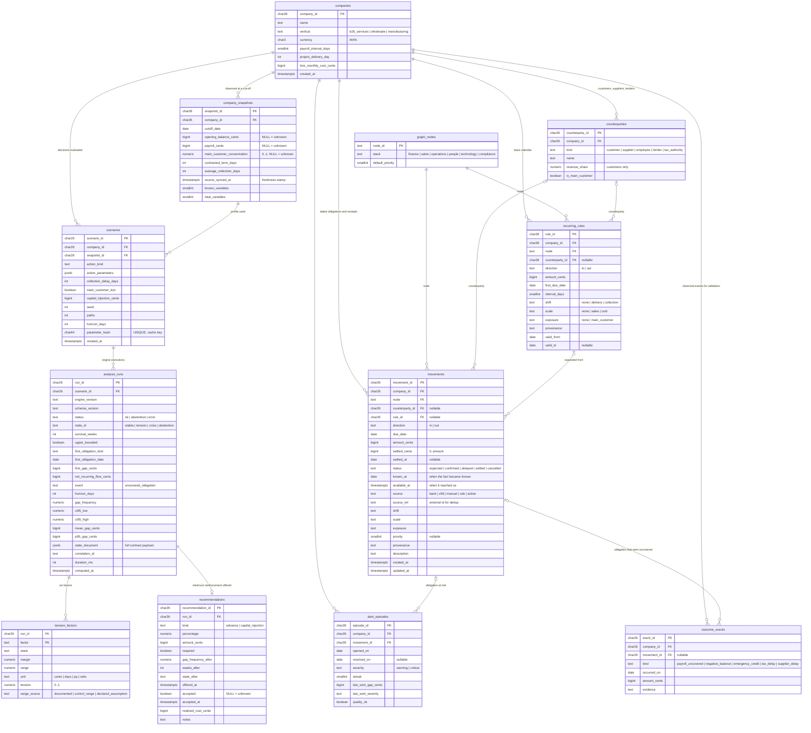

# Data model — entity-relationship design

Persistence model for the structural fragility engine. It answers two questions
the code alone does not: **what does the database look like** when the product
moves past the stateless MVP, and **what is the shape of one SME cash movement**
that the engine consumes.

Status: `movements` is **deployed** on Tiger Cloud — PostgreSQL with the
TimescaleDB extension — and read and written by `services/domain` through
`GET`/`POST /v1/movements`. Everything else in the system stays on AWS, so no
RDS or Aurora is involved and `architecture.md` decision 10 (no database inside
AWS) still holds. The remaining tables are created by the same DDL but no code
writes to them yet.

The analysis path is unchanged: the engine is still a pure function of its
request, and the `company` block of that request
(`contracts/engine-request.schema.json`) is exactly a projection of the tables
below. The DDL lives in `contracts/database/schema.sql`.

---

## 1. Design rules

Inherited from `AGENTS.md`, the evaluation report §5 and the engine invariants.

| Rule | Where it lands |
| --- | --- |
| Money is an integer count of cents | every `*_cents` column is `BIGINT`; no `NUMERIC`, no floats |
| An unknown balance is never zero | `company_snapshots.opening_balance_cents` is `NULL`-able; `NULL` counts against coverage and forces abstention |
| No future information from the cut-off | `movements.known_at` and `movements.available_at` stamp when a fact became knowable; historical runs filter on them |
| Duplicates are excluded, conflicts are errors | `UNIQUE (company_id, source, source_ref, due_date)` on `movements`; `due_date` is in the key only because TimescaleDB requires the partition column in every unique index, so the index alone no longer catches a re-import under a corrected date — `internal/movements/application` rejects that before inserting |
| Reconciliation is explicit | `0 <= settled_cents <= amount_cents` as a `CHECK`; status is derived, never typed by hand |
| Every relationship declares its provenance | `provenance` enum `known · declared · learned · hypothetical` on rules and movements |
| A committed scenario is immutable, seed fixed at creation | `scenarios` rows are insert-only; `parameter_hash` makes them addressable and cacheable |
| Every probability declares event and horizon | `analysis_runs` stores `event` and `horizon_days` next to the frequency |
| Alerts are keyed by company + obligation + episode | `alert_episodes` (report §5, "repeated alerts") |
| Recommendations are tracked to their outcome | `recommendations` and `outcome_events` (report §5, "effect of the recommendations") |

Identifiers are ULIDs stored as `CHAR(26)`. Dates relative to a cut-off are
computed, never stored: the database stores calendar dates and the engine
converts them to day offsets at request time.

---

## 2. Entity-relationship diagram

---

## 3. The movements table

`movements` is the table the engine reads. One row is one dated receipt or
obligation of the SME, in the company's currency, relative to a real calendar
date. The engine turns `due_date − cutoff_date` into the day offset its ledger
uses, and `amount_cents − settled_cents` into the outstanding amount.

| Column | Type | Meaning | Engine field |
| --- | --- | --- | --- |
| `movement_id` | `CHAR(26)` | ULID. Part of the primary key together with `due_date`, which rides along only because it is the partition column | `id` |
| `company_id` | `CHAR(26)` | owner | request `company.company_id` |
| `node` | `TEXT` → `graph_nodes` | capability the movement funds or consumes (`payroll`, `collection`, `supplier`, …) | `node` |
| `counterparty_id` | `CHAR(26)`, nullable | the customer, supplier, lender or authority | — |
| `rule_id` | `CHAR(26)`, nullable | the recurring rule that generated it, if any | — |
| `direction` | `in` / `out` | receipt or commitment | `direction` |
| `due_date` | `DATE` | contractual date | `day = due_date − cutoff_date` |
| `amount_cents` | `BIGINT ≥ 0` | contractual amount | `amount_cents` |
| `settled_cents` | `BIGINT`, `0..amount_cents` | reconciled so far | `settled_cents` |
| `settled_at` | `DATE`, nullable | date of the last settlement | — |
| `status` | enum | `expected · confirmed · delayed · settled · cancelled`, derived by the loader | excluded when `settled` or `cancelled` |
| `known_at` | `DATE` | when the fact became knowable; must be ≤ cut-off to be used | `known_at` |
| `available_at` | `TIMESTAMPTZ` | when it reached the system; report §5 "stale data" | filter for historical simulations |
| `source` | enum | `bank · cfdi · manual · rule · action` | — |
| `source_ref` | `TEXT` | external identifier; `UNIQUE (company_id, source, source_ref)` | dedup |
| `shift` | enum | which stochastic delay moves it: `none · delivery · collection` | `shift` |
| `scale` | enum | which stochastic factor scales it: `none · sales · cost` | `scale` |
| `exposure` | enum | `main_customer` when the amount contains the main customer's share | `exposure` |
| `priority` | `SMALLINT`, nullable | intraday order among commitments; default from `graph_nodes` | `priority` |
| `provenance` | enum | `known · declared · learned · hypothetical` | `provenance` |

**What being a hypertable costs**

`movements` is partitioned by `due_date`, and TimescaleDB enforces uniqueness
per chunk: *"Any `UNIQUE` or `PRIMARY KEY` index must include the partition
column."* Three things follow, and they are the price of the partitioning:

- the primary key is `(movement_id, due_date)`, not `movement_id` alone;
- the dedup index is `(company_id, source, source_ref, due_date)`, so the same
  `source_ref` re-imported under a **corrected date** no longer collides — the
  use case in `services/domain/internal/movements/application` rejects it
  instead, and a concurrent pair of writes could in principle slip past;
- `alert_episodes` and `outcome_events` carry `movement_due_date` next to
  `movement_id`, because a foreign key must reference the whole key.

**Conventions the engine relies on**

- Receipts are applied before commitments on the same day, then by `priority`
  (`materials 10 · hiring 20 · supplier 30 · payroll 40 · debt 50 · tax 60`).
- A movement with `known_at > cutoff_date` is future information and is rejected.
- A movement with `due_date < cutoff_date` and `status ≠ settled` is a past due
  item that must be reconciled before simulating.
- `shift = collection` is what the stress slider *Retraso en cobranza* moves. The
  demo profile applies it to the project's collection only, as the evaluation
  report does; marking base receivables with `shift = collection` extends the
  stress to them.

---

## 4. How the engine request maps to the tables

| Request field | Source |
| --- | --- |
| `company.opening_balance_cents`, `payroll_cents`, `main_customer_concentration`, `contracted_term_days`, `average_collection_days` | `company_snapshots` at `cutoff_date` |
| `company.payroll_interval_days`, `project_delivery_day`, `hire_monthly_cost_cents` | `companies` |
| `company.recurring_rules[]` | `recurring_rules` valid at the cut-off (`first_day = first_due_date − cutoff_date`) |
| `company.one_off_movements[]` | `movements` with `status ∉ {settled, cancelled}`, `rule_id IS NULL`, `known_at ≤ cutoff_date` |
| `action`, `stress`, `seed`, `paths`, `horizon_days` | `scenarios` |
| response | `analysis_runs` (+ `tension_factors`, `recommendations`) |

Coverage is `known_variables / total_variables` over the snapshot's seven
profile variables; above 20% unknown the run is an `abstention`.

---

## 5. What the MVP stores and what it does not

| Now | Later |
| --- | --- |
| `movements` and `graph_nodes` on Tiger Cloud, written by `/v1/movements` | the loaders that fill `movements` from bank feeds and CFDI, instead of by hand |
| Demo profile as a JSON fixture (`company_demo_agency.json`) | `companies`, `company_snapshots`, `recurring_rules`, `counterparties` |
| Four fallback state documents under `apps/web/public/states/` | `scenarios` + `analysis_runs`, keyed by `parameter_hash` (the CloudFront cache key becomes a row) |
| Nothing about alerts or outcomes | `alert_episodes`, `outcome_events`, `recommendations` — the tables the evaluation report §5 says are required before any prospective claim |
| The analysis still builds its request from the fixture, not from `movements` | `company.one_off_movements[]` read from the rows the ledger holds |

Adding the database does not change the engine: `analysis.analyze()` receives
the same request either way. It changes who builds the request.
