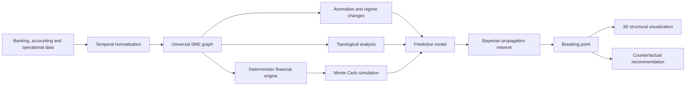

# Structural Fragility Engine for SMEs

## 1. Core idea

A platform that builds a **structural twin of an SME** through a graph of financial and operational dependencies.

Each node represents a capability required to keep the business running: collections, cash, payroll, inventory, customers, suppliers, technology, tax compliance, and so on.

The system:

1. Observes how the company is operating.
2. Detects dependencies and fragilities that are not yet evident.
3. Simulates decisions and perturbations.
4. Computes how the impact would propagate through the business.
5. Identifies the first breaking point.
6. Recommends an action to reinforce the structure.

> **We are not trying to predict exactly when a company will fail. We are trying to detect when it is losing the capacity to absorb a perturbation, and to show what could trigger a crisis.**

---

## 2. Problem

An SME can look healthy in its financial statements and be structurally fragile at the same time.

Example:

- Sales are growing.
- It reports a profit.
- It maintains a positive balance.
- It wins a large project.

But:

- 45% of its revenue depends on one customer.
- It must finance materials and payroll before collecting.
- The customer pays at 60 days.
- Its cash buffer has been shrinking.
- An additional 15-day delay would make payroll impossible to cover.

A traditional financial analysis might conclude the project is profitable. Our system would show that **the combination of dependencies makes the business vulnerable**.

---

## 3. Target user

### Primary user

Owner, general manager or finance lead of an SME who needs to evaluate decisions such as:

- Accepting a project.
- Selling on credit.
- Hiring employees.
- Buying inventory or machinery.
- Opening a branch.
- Requesting financing.
- Increasing fixed costs.
- Depending on one customer or supplier.
- Extending payment terms.

### Promise

> **Before you make a decision, find out which part of your company would weaken, what event could break it, and how to reinforce it.**

---

## 4. Initial sectors in Mexico

We would not begin with pharmaceuticals, agriculture or mining. They are important sectors, but their regulation, cycles, data and risks are too particular for a first model.

According to the 2024 Economic Censuses, 44.6% of Mexican establishments belong to commerce, 42.1% to services and 11.3% to manufacturing. [INEGI, Censos Económicos 2024](https://www.inegi.org.mx/contenidos/saladeprensa/boletines/2025/ce/CE2024_def_RR.pdf)

### Recommended initial vertical

**Project-based B2B services**, such as:

- Marketing agencies.
- Consultancies.
- Software companies.
- Maintenance services.
- Installers.
- Professional practices.
- Logistics services.
- Small contractors.

Advantages:

- They take on projects with upfront costs.
- They sell on credit.
- They have accounts receivable.
- Payroll is a critical obligation.
- They may depend on few customers.
- Their decisions fit the demonstration perfectly.

### Second vertical

**Wholesale and distribution**, because it allows modelling inventory, suppliers, customer credit, turnover, concentration and working capital.

### Third vertical

**Small-scale manufacturing of food, textiles or construction products**.

Specialized modules for agriculture, pharmacy or mining can be created afterwards.

---

## 5. Universal SME graph

The universal stacks should be relatively stable domains. Six are recommended.

### 5.1 Finance

- Available cash.
- Minimum reserve.
- Accounts receivable.
- Accounts payable.
- Debt.
- Available credit.
- Upcoming payroll.
- Upcoming taxes.
- Fixed costs.
- Operating margin.
- Net flow.
- Working capital.

### 5.2 Sales and customers

- Recurring revenue.
- Sales pipeline.
- Main customer.
- Customer concentration.
- Average ticket.
- Conversion.
- Cancellations.
- Average collection period.
- Customer delinquency.
- Contract dependency.

### 5.3 Operations and suppliers

- Inventory.
- Inventory turnover.
- Main supplier.
- Supplier concentration.
- Delivery time.
- Capacity utilization.
- Variable costs.
- Quality.
- Pending production.
- Projects in execution.

### 5.4 Human resources

- Payroll.
- Headcount.
- Critical staff.
- Available capacity.
- Turnover.
- Committed hours.
- Planned hires.
- Cost per employee.
- Dependency on key people.

### 5.5 Technology and information

- Invoicing system.
- Point of sale.
- Accounting.
- Critical infrastructure.
- Technology provider.
- Cybersecurity.
- Backups.
- Operational availability.
- Dependency on external platforms.

### 5.6 Compliance and environment

- Tax obligations.
- Licences.
- Insurance.
- Regulation.
- Exchange rate.
- Input inflation.
- Seasonality.
- Geographic risk.
- Sector dependency.

External factors are not controllable pieces, but they can apply pressure on the graph.

---

## 6. Types of relationship

Not every connection means the same thing. Each edge of the graph must include:

```yaml
source: collections
target: cash
type: finances
direction: positive
delay: 7 days
strength: 0.82
confidence: 0.91
```

Relationship types:

- `finances`
- `consumes`
- `depends_on`
- `delays`
- `increases`
- `reduces`
- `blocks`
- `protects`
- `substitutes`
- `correlates_with`

Four sources must be distinguished:

- **Known relationship:** arises from accounting or operational rules.
- **Declared relationship:** supplied by the user.
- **Learned relationship:** appears statistically in the data.
- **Hypothetical relationship:** used only for a simulation.

This avoids presenting correlation as causality.

---

## 7. Events the model should predict

The system should not begin by predicting "bankruptcy". It should predict observable intermediate events.

### Main outcomes

1. Probability of a negative balance.
2. Probability of failing to cover the next payroll.
3. Probability of using an overdraft or emergency credit.
4. Probability of a tax delay.
5. Probability of a delay with suppliers.
6. Probability of dropping below four weeks of cash.
7. Probability of default over the next 30, 60 or 90 days.
8. Probability of operational interruption.
9. Estimated time to the breaking point.
10. Expected loss under the scenario.

Transactional data can have value for predicting short-term deterioration. A trial reported by the BIS obtained AUC of 0.94 with XGBoost over a one-month horizon, although it used charge delinquency as a proxy rather than legal bankruptcy. [BIS Papers No. 148](https://www.bis.org/publ/bppdf/bispap148.pdf)

---

## 8. Actions the user can introduce

### Finance

- Request a loan.
- Draw on a credit line.
- Refinance debt.
- Withdraw profits.
- Increase the reserve.
- Delay payments.
- Buy an asset.

### Sales

- Accept a large project.
- Extend credit to a customer.
- Extend the collection period.
- Reduce prices.
- Increase discounts.
- Sign exclusivity.
- Depend on one large customer.

### Operations

- Buy inventory.
- Change supplier.
- Increase production.
- Open a branch.
- Buy machinery.
- Subcontract a process.
- Accept an extraordinary order.

### Human resources

- Hire employees.
- Raise salaries.
- Lay off staff.
- Hire specialists.
- Change bonuses or commissions.
- Add shifts.

### Technology

- Change the sales system.
- Migrate to another provider.
- Automate a process.
- Suspend a platform.
- Contract infrastructure.
- Reduce technology spend.

Each action becomes changes to nodes and edges:

```yaml
action: accept_project
total_revenue: 500000
initial_cost: 300000
advance: 0
collection_days: 60
additional_staff: 2
duration: 90
```

---

## 9. Analytical pipeline

Topology must not be the only model. The most realistic system is hybrid.



### Layer 1: deterministic financial engine

It must compute:

- Calendar of inflows and outflows.
- Payroll.
- Taxes.
- Accounts payable.
- Accounts receivable.
- Debt service.
- Weekly balance.
- Working capital.
- Weeks of survival.

This layer guarantees accounting coherence. It needs no machine learning.

### Layer 2: anomaly detection

Possible algorithms:

- Isolation Forest.
- Robust Z-score.
- Change-point detection.
- Bayesian Online Change Point Detection.
- CUSUM.
- Autoencoder, once enough information exists.

Objective:

> Detect that current behaviour no longer belongs to the company's normal regime.

### Layer 3: critical transition signals

Compute over moving windows:

- Variance.
- Lag-1 autocorrelation.
- Recovery time.
- Covariance between nodes.
- Dominant eigenvalue of the covariance matrix.
- Synchronization between variables.

Rising variance and autocorrelation can act as an early signal in some systems approaching a critical transition, but they do not necessarily appear before every transition. [Scheffer et al., Nature](https://www.nature.com/articles/nature08227)

### Layer 4: topological analysis

Apply persistent homology over temporal vectors such as:

```text
[balance, revenue, collections, payroll, fixed costs,
 customer concentration, inventory, debt]
```

Features:

- L1/L2 norm of the persistence landscape.
- Persistent entropy.
- Number and duration of components/cycles.
- Wasserstein distance between normal and current operation.
- Distance between base scenario and simulated scenario.
- Topological regime change.

Its function is to detect **multivariate structural changes**, not to produce a bankruptcy probability directly.

### Layer 5: Monte Carlo simulation

Simulate thousands of futures by varying:

- Collection days.
- Sales.
- Costs.
- Cancellations.
- Exchange rate.
- Customer loss.
- Supplier failures.
- Project duration.

Result:

```text
P(failing to cover payroll within 30 days) = 18%
P(negative balance within 60 days) = 37%
P(using emergency credit) = 54%
```

### Layer 6: supervised predictive model

Start with:

- Logistic regression as a baseline.
- XGBoost or CatBoost.
- Survival analysis to estimate time to crisis.

Inputs:

- Financial features.
- Temporal trends.
- Anomalies.
- Topological features.
- Graph characteristics.
- Simulation results.

Output:

- Calibrated probability per event and horizon.

We would not begin with a Graph Neural Network. A GNN needs many companies, relationships and labelled events. It can be added later to learn contagion between customers, suppliers and related companies.

### Layer 7: dynamic Bayesian network

This layer is the best bridge between the backend and the visual experience.

```text
Large project
    → upfront cost
        → less cash
            → lower payroll coverage
                → operational risk

Large project
    → customer concentration
        → collection risk
            → negative balance
```

The Bayesian network makes it possible to update the probability of dependent nodes when one piece changes, and to show the propagation.

### Layer 8: explainability and counterfactuals

The system must compute:

> "What is the smallest change that avoids the crisis?"

Examples:

- Request a 35% advance payment.
- Collect at 30 days instead of 60.
- Finance 50% of the machinery.
- Hire one person now and another later.
- Cut $42,000 of recurring expenses.
- Diversify 15% of revenue.

This will probably be the most valuable part for the user.

---

## 10. How a crack is generated

A crack must not come from a correlation alone.

It is generated when several pieces of evidence coincide:

```text
Crack =
    exposure to the event
    × node sensitivity
    × dependency on other nodes
    × event probability
    × lack of recovery capacity
```

Example:

```text
Node: collections

Exposure: 0.80
Dependency on main customer: 0.72
Probability of delay: 0.35
Recovery capacity: low
Affected nodes: cash, payroll, suppliers

Result: critical crack
```

In the interface, the crack represents:

> **This support still works, but it can no longer absorb a reasonable perturbation.**

---

## 11. Front-end experience

The main screen shows an abstract 3D structure, not necessarily a literal Jenga tower.

Each group corresponds to a stack:

- Finance.
- Sales.
- Operations.
- People.
- Technology.
- Compliance.

Each piece represents a node. The visualization must allow the user to:

- Select a stack.
- Open its branches.
- Identify strong and fragile supports.
- Introduce a decision.
- Observe the propagation.
- Find the breaking point.
- Try a solution.
- Compare before and after.

### Visual sequence

```text
Current state
    ↓
User introduces a decision
    ↓
The engine modifies the nodes
    ↓
Tension appears in a support
    ↓
It propagates through the dependencies
    ↓
The structure deforms or cracks
    ↓
The system flags the first default
    ↓
The user tries a reinforcement
    ↓
The structure regains stability
```

It must always be accompanied by an explanation:

> The project is profitable, but it increases your dependency on collections. If the customer is 14 days later than expected, you will not be able to cover the second payroll. Requesting a 38% advance payment eliminates this vulnerability.

---

## 12. Demonstrable demo

### Company

B2B services agency:

- 18 employees.
- Five active customers.
- One customer generates 46% of revenue.
- Fortnightly payroll.
- Average collection at 45 days.
- Currently positive balance.

### Decision

Accept a project of $800,000:

- Initial cost: $380,000.
- Two new hires.
- Payment on completion.
- Expected term: 60 days.

### Conventional result

```text
Revenue: +$800,000
Costs: -$560,000
Expected profit: +$240,000
Apparent decision: accept
```

### Structural result

```text
P(failing to cover payroll within 60 days): 64%
Reaction time: 11 days
Initial node: collections
First critical node: payroll coverage
Amplifying factor: customer concentration
Breaking point: additional delay of 13 days
```

### Recommendation

```text
Request a 40% advance payment
or split the payment into three milestones
```

After applying the change:

```text
P(failing to cover payroll): 17%
Reaction time: 39 days
Structural state: resilient
```

---

## 13. How to demonstrate that the model really works

The following must be compared:

1. Traditional financial model.
2. Traditional model plus time series.
3. The previous model plus topological and graph features.

Metrics:

- Precision-recall.
- AUC-ROC.
- False positives.
- Crises detected.
- Days of anticipation.
- Probability calibration.
- Stability by sector.
- Added value of topology.

The central scientific question will be:

> **Do topological and dependency features allow the crisis to be detected earlier, or with fewer false positives, than a conventional cash-flow model?**

If they do not improve the result, topology must not be kept merely because it makes the pitch interesting.

---

## 14. Realistic MVP scope

### Do build

- One vertical: B2B services.
- Universal graph with 20–30 nodes.
- Five frequent decisions.
- Deterministic cash engine.
- Monte Carlo simulation.
- Anomaly detection.
- Experimental topological features.
- Logistic regression and XGBoost.
- Propagation through a Bayesian network.
- One interactive visual structure.
- One counterfactual recommendation.

### Do not build yet

- Every sector.
- Universal bankruptcy prediction.
- A complex GNN.
- Full banking integrations.
- A credit marketplace.
- Regulatory models.
- Dozens of actions per department.
- An excessively realistic 3D structure.

---

## 15. Final definition

> **A structural fragility engine for SMEs that turns financial and operational information into a living graph of dependencies. The system detects anomalous changes, simulates decisions and perturbations, computes how they would propagate through the business, and identifies the breaking point before it shows up as a cash shortfall. The interface turns the graph into a visual structure where the user can observe which support weakens, which obligations are exposed, and what minimum action would restore stability.**

The right architecture is:

> **Financial engine + time series + Monte Carlo simulation + dynamic Bayesian network + supervised model + topological features.**

Topology contributes a structural signal; the Bayesian network explains propagation; Monte Carlo measures scenarios; the supervised model estimates probabilities; and the financial engine preserves accounting coherence. That combination can become a defensible and evaluable product.
